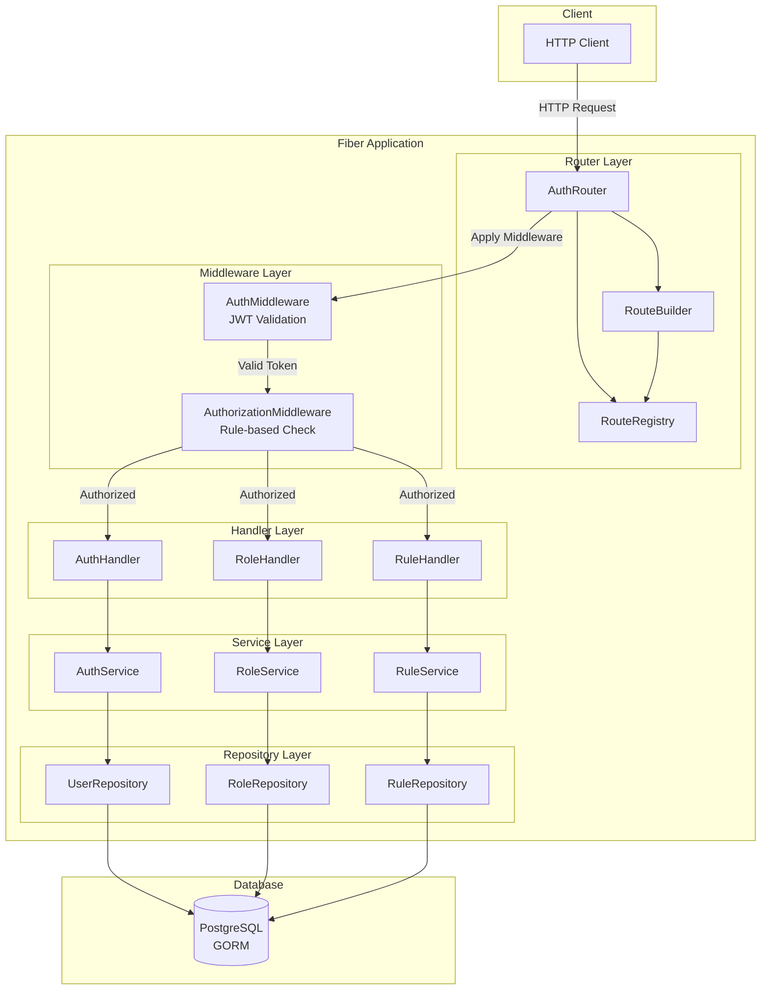
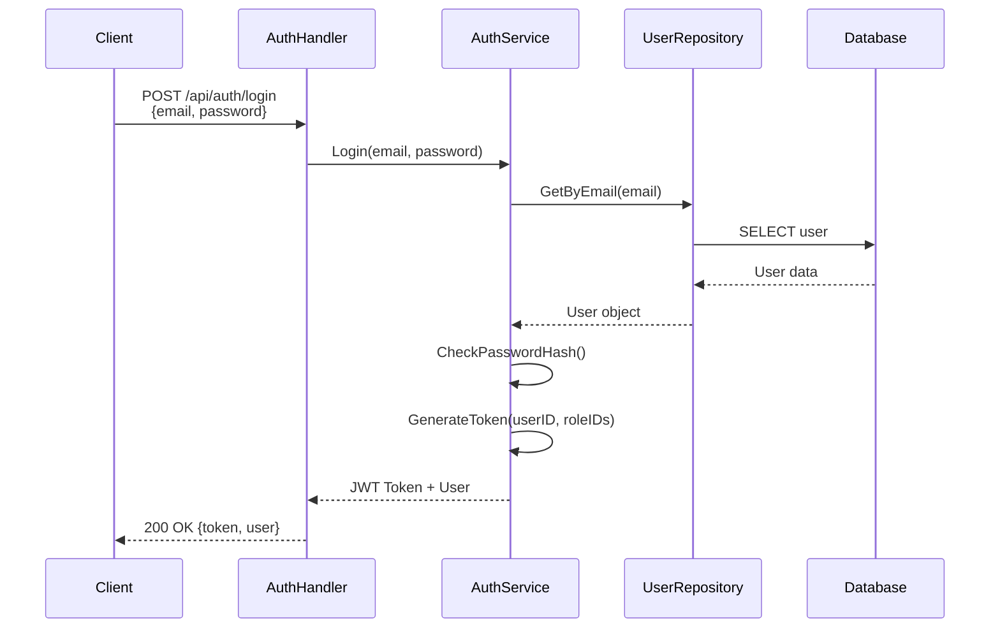
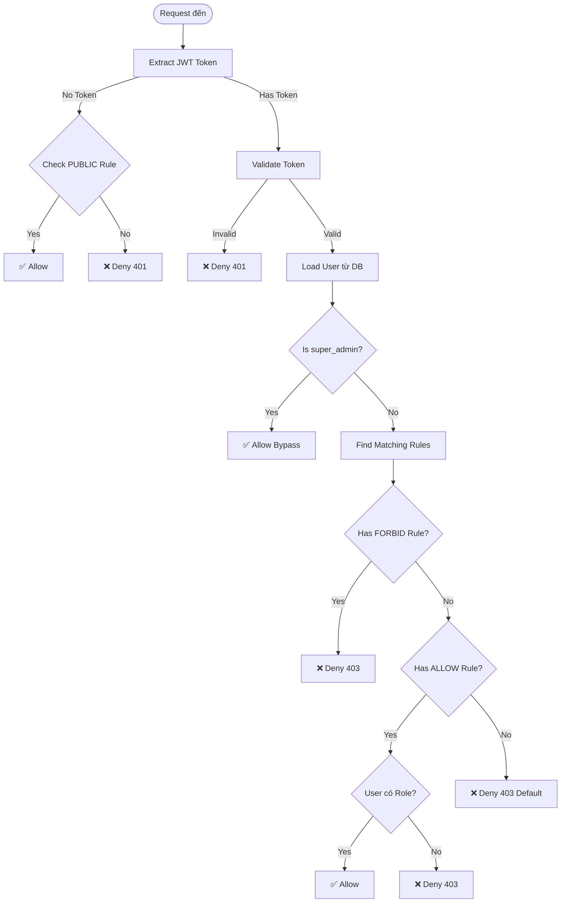
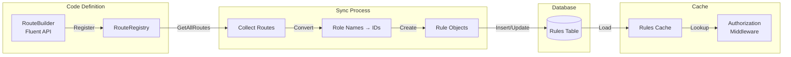
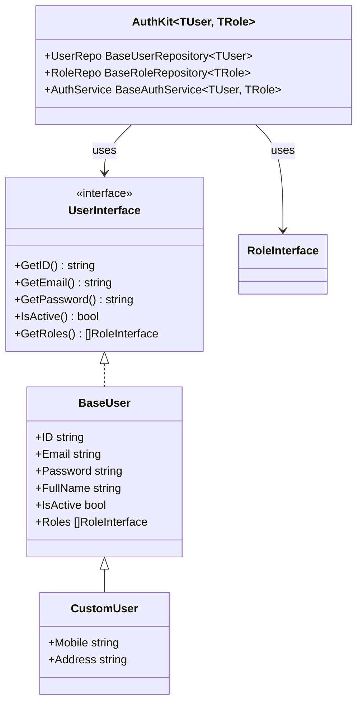

# 1. Tổng quan về AuthKit

Tài liệu này mô tả tổng quan về AuthKit - một module Go tái sử dụng cao cho ứng dụng Fiber REST API.

---

## 1.1. AuthKit là gì?

AuthKit là một module Go được thiết kế để cung cấp giải pháp authentication và authorization hoàn chỉnh cho các ứng dụng Fiber REST API.

### Đặc điểm chính:

- **Module Go tái sử dụng cao** cho ứng dụng Fiber REST API
- **Authentication & Authorization** với GORM, PostgreSQL
- **Generic Types** để mở rộng với Custom User/Role models
- **Tích hợp goerrorkit** để xử lý lỗi thống nhất
- **Rule-based Authorization** với caching và tối ưu hiệu suất
- **Fluent API** để định nghĩa routes một cách trực quan

### Kiến trúc tổng thể



## 1.2. Mục đích và phạm vi

### Mục đích

Cung cấp giải pháp **authentication & authorization hoàn chỉnh, dễ tích hợp** cho các ứng dụng Fiber REST API với:

- ✅ Tích hợp nhanh chóng với vài dòng code
- ✅ Type-safe với Go Generics
- ✅ Flexible và extensible với custom models
- ✅ Performance cao với caching và optimization
- ✅ Security tốt với JWT và rule-based authorization

### Phạm vi

AuthKit cung cấp các tính năng sau:

- **JWT-based authentication**: Login, Register, Token validation
- **Rule-based authorization**: Public, Allow, Forbid rules
- **Microservice architecture support**: Service name isolation cho multi-service deployments
- **Role-based access control (RBAC)**: User-Role relationships, System roles
- **Route management**: Fluent API để định nghĩa routes, tự động sync vào database
- **Generic Types**: Hỗ trợ Custom User/Role models với type safety

## 1.3. Các tính năng chính

### 1.3.1. Authentication

- **Login**: Validate credentials, generate JWT token với role IDs
- **Register**: Tạo user mới, hash password với bcrypt
- **JWT Token**: Generation, validation, và refresh
- **Profile Management**: Get, Update, Delete profile



### 1.3.2. Authorization

- **Rule-based**: 3 loại rules (Public, Allow, Forbid)
- **Pattern Matching**: Wildcard support (`/api/users/*`)
- **Caching**: Rules được cache để tối ưu hiệu suất
- **super_admin Bypass**: Role đặc biệt bypass tất cả rules



### 1.3.3. Role Management

- **System Roles**: Roles không thể xóa (`is_system = true`)
- **super_admin Role**: Role đặc biệt với quyền bypass
- **User-Role Assignment**: Many-to-many relationship
- **Role API**: CRUD operations cho roles

### 1.3.4. Route Management

- **Fluent API**: Định nghĩa routes một cách trực quan
- **Auto Sync**: Tự động sync routes vào database
- **Fixed Rules**: Rules không thể sửa từ database
- **Route Registry**: Quản lý routes với exact và pattern matching



### 1.3.5. Extensibility

- **Generic Types**: `AuthKit[TUser, TRole]` với type constraints
- **Custom Models**: Embed BaseUser/BaseRole để mở rộng
- **Interface-based**: UserInterface và RoleInterface
- **Type Safety**: Compile-time type checking



### 1.3.6. Performance

- **Rules Caching**: In-memory cache với O(1) lookup
- **Role IDs in JWT**: Không cần query database mỗi request
- **Batch Operations**: Batch convert role names → IDs
- **Early Exit**: PUBLIC và super_admin check trước

## 1.4. Kiến trúc tổng thể (High-level Overview)

AuthKit được thiết kế theo **kiến trúc phân lớp (Layered Architecture)** với 5 lớp chính:

```
┌─────────────────────────────────────┐
│   Router Layer                      │  ← Đăng ký routes, quản lý metadata
├─────────────────────────────────────┤
│   Middleware Layer                  │  ← Authentication & Authorization
├─────────────────────────────────────┤
│   Handler Layer                     │  ← Xử lý HTTP requests/responses
├─────────────────────────────────────┤
│   Service Layer                     │  ← Business logic & validation
├─────────────────────────────────────┤
│   Repository Layer                  │  ← Data access với GORM
└─────────────────────────────────────┘
           ↓
    ┌──────────────┐
    │  PostgreSQL  │
    └──────────────┘
```

**Đặc điểm thiết kế:**
- ✅ **Separation of Concerns**: Mỗi lớp có trách nhiệm riêng biệt
- ✅ **Dependency Injection**: Dependencies được inject từ trên xuống
- ✅ **Generic Types**: Type-safe với Go generics
- ✅ **Builder Pattern**: Flexible initialization với `AuthKitBuilder`
- ✅ **Rule-based Authorization**: Flexible và configurable
- ✅ **Caching**: Tối ưu hiệu suất với in-memory cache

**Luồng xử lý request đơn giản:**
```
Client Request → Router → Middleware (Auth + Authz) → Handler → Service → Repository → Database
                                                                                        ↓
Response ← ← ← ← ← ← ← ← ← ← ← ← ← ← ← ← ← ← ← ← ← ← ← ← ← ← ← ← ← ← ← ← ← ← ← ← ← ← ←
```

> 💡 **Lưu ý**: Để hiểu chi tiết về kiến trúc, cách các lớp tương tác và luồng xử lý request, xem [2. Kiến trúc tổng thể](./02-kien-truc-tong-the.md)

---

**Xem thêm:**
- [2. Kiến trúc tổng thể](./02-kien-truc-tong-the.md)
- [3. Middleware và Security](./03-middleware-security.md)
- [Mục lục](./README.md)

