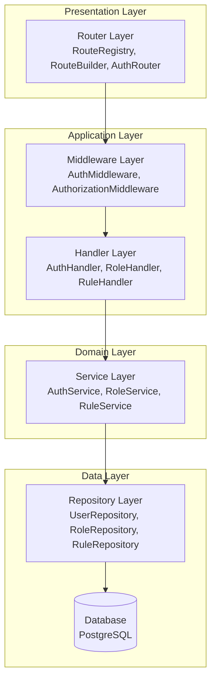
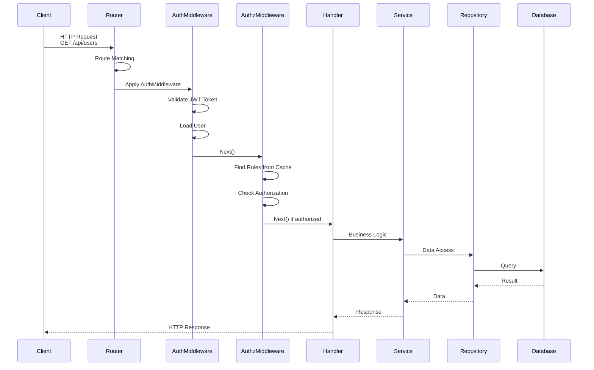
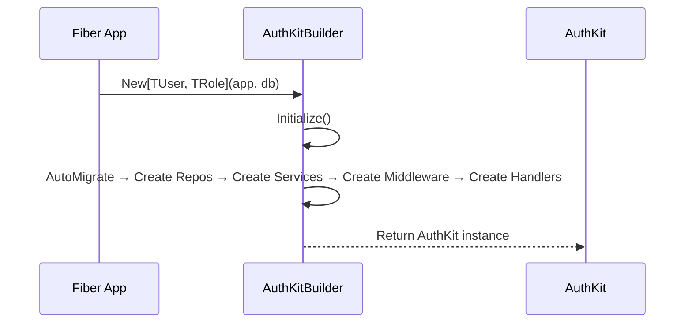
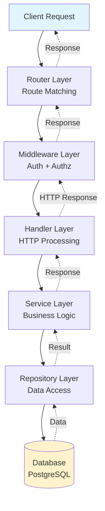

# 2. Kiến trúc tổng thể

Tài liệu này mô tả tổng quan về kiến trúc của AuthKit - cách các thành phần được tổ chức và tương tác với nhau.

> 📖 **Trước khi đọc**: Nếu chưa biết AuthKit là gì, hãy xem [1. Tổng quan về AuthKit](./01-tong-quan.md) trước.  
> 🔍 **Chi tiết**: Để hiểu về middleware và security, xem [3. Middleware và Security](./03-middleware-security.md).

---

## 2.1. Mô hình kiến trúc (Layered Architecture)

AuthKit sử dụng **kiến trúc phân lớp** để tách biệt trách nhiệm, giúp hệ thống dễ bảo trì và mở rộng.

### 2.1.1. Các lớp kiến trúc



**5 lớp chính:**

1. **Router Layer**: Đăng ký routes, quản lý metadata, route matching
2. **Middleware Layer**: Authentication (xác thực) và Authorization (phân quyền)
3. **Handler Layer**: Xử lý HTTP requests/responses
4. **Service Layer**: Business logic và validation
5. **Repository Layer**: Truy cập database với GORM

### 2.1.2. Tại sao sử dụng Layered Architecture?

- ✅ **Tách biệt trách nhiệm**: Mỗi lớp chỉ làm một việc cụ thể
- ✅ **Dễ bảo trì**: Thay đổi ở một lớp không ảnh hưởng đến lớp khác
- ✅ **Dễ test**: Có thể mock từng lớp độc lập
- ✅ **Dễ mở rộng**: Thêm tính năng mới mà không phá vỡ cấu trúc hiện tại

### 2.1.3. Trách nhiệm từng lớp

| Lớp | Thành phần chính | Trách nhiệm |
|-----|------------------|-------------|
| **Router** | RouteRegistry, RouteBuilder, AuthRouter | Đăng ký routes, quản lý metadata, route matching |
| **Middleware** | AuthMiddleware, AuthorizationMiddleware | Xác thực JWT token, kiểm tra quyền truy cập |
| **Handler** | AuthHandler, RoleHandler, RuleHandler | Parse request, gọi service, format response |
| **Service** | AuthService, RoleService, RuleService | Business logic, validation, xử lý nghiệp vụ |
| **Repository** | UserRepository, RoleRepository, RuleRepository | Truy cập database, CRUD operations |

> 💡 **Chi tiết**: Để hiểu cách middleware hoạt động, xem [3. Middleware và Security](./03-middleware-security.md).

---

## 2.2. Luồng xử lý request (Request Flow)

Luồng xử lý một HTTP request từ client đến database và trả về response:



**Tóm tắt các bước:**

1. **Router**: Nhận request, tìm route trong RouteRegistry
2. **AuthMiddleware**: Validate JWT token, load user, store vào context
3. **AuthorizationMiddleware**: Tìm rules từ cache, kiểm tra quyền truy cập
4. **Handler**: Parse request, gọi service
5. **Service**: Xử lý business logic
6. **Repository**: Truy cập database
7. **Response**: Quay ngược lại qua các lớp và trả về client

> 🔍 **Chi tiết**: Để hiểu rõ hơn về luồng middleware, xem [3. Middleware và Security](./03-middleware-security.md#31-authentication-middleware---người-gác-cổng).

---

## 2.3. Các thành phần chính (Components)

### 2.3.1. AuthKit - Main Container

`AuthKit[TUser, TRole]` là struct chính chứa tất cả dependencies:

```go
type AuthKit[TUser UserInterface, TRole RoleInterface] struct {
    DB     *gorm.DB
    Config *Config
    
    // Repositories, Services, Middleware, Handlers, RouteRegistry
    // ...
}
```

**Trách nhiệm:**
- Container cho tất cả dependencies
- Cung cấp methods: `SyncRoutes()`, `InvalidateCache()`
- Quản lý lifecycle của các components

### 2.3.2. RouteRegistry - Route Management

Quản lý metadata của tất cả routes:

- **exactMap**: `"METHOD|PATH"` → RouteMetadata (O(1) lookup)
- **patternList**: Routes có wildcard `*` để pattern matching
- Thread-safe với `sync.RWMutex`

**Key Format**: `"METHOD|PATH"` (ví dụ: `"GET|/api/users"`)

### 2.3.3. AuthKitBuilder - Dependency Injection

Sử dụng Builder Pattern để khởi tạo với dependencies injection:



**Quy trình khởi tạo:**
1. Auto Migrate database tables
2. Tạo Repositories với generic types
3. Tạo Services với repositories
4. Tạo Middleware với repositories và config
5. Tạo Handlers với services
6. Tạo RouteRegistry

---

## 2.4. Nguyên tắc thiết kế

AuthKit tuân theo các nguyên tắc thiết kế sau:

- **Separation of Concerns**: Mỗi lớp chỉ làm một việc cụ thể
- **Dependency Injection**: Dependencies được inject từ trên xuống
- **Generic Types**: Type-safe với Go generics, hỗ trợ custom models
- **Interface-based**: Sử dụng interfaces để dễ test và mở rộng
- **Single Responsibility**: Mỗi component chỉ có một lý do để thay đổi

---

## 2.5. Tóm tắt

### Đặc điểm chính

- ✅ **Layered Architecture**: Tách biệt rõ ràng các trách nhiệm
- ✅ **Generic Types**: Type-safe với Go generics
- ✅ **Dependency Injection**: Dependencies được inject qua constructor
- ✅ **Builder Pattern**: Flexible initialization
- ✅ **Rule-based Authorization**: Flexible và configurable
- ✅ **Caching**: Tối ưu hiệu suất với in-memory cache

### Luồng dữ liệu



---

**Xem thêm:**
- [1. Tổng quan về AuthKit](./01-tong-quan.md) - Giới thiệu tổng quan
- [3. Middleware và Security](./03-middleware-security.md) - Chi tiết về authentication và authorization
- [4. Hệ thống phân quyền](./04-he-thong-phan-quyen.md) - Rule-based authorization
- [Mục lục](./README.md)
