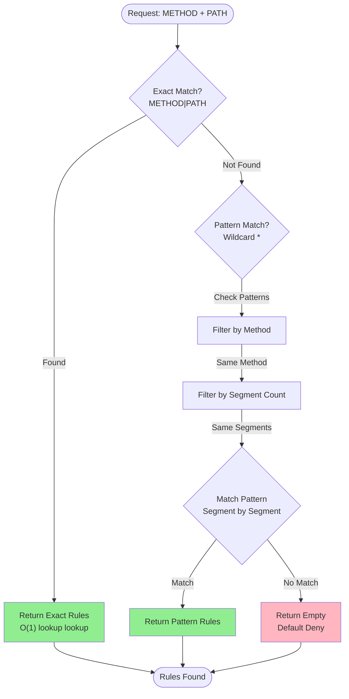
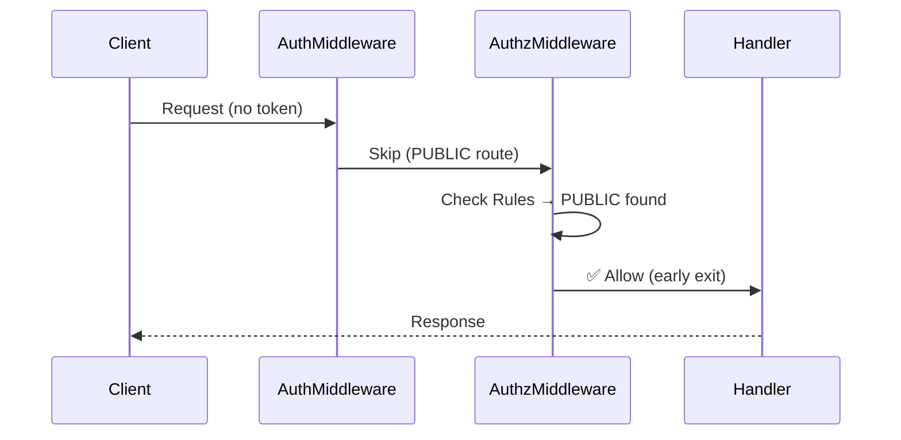
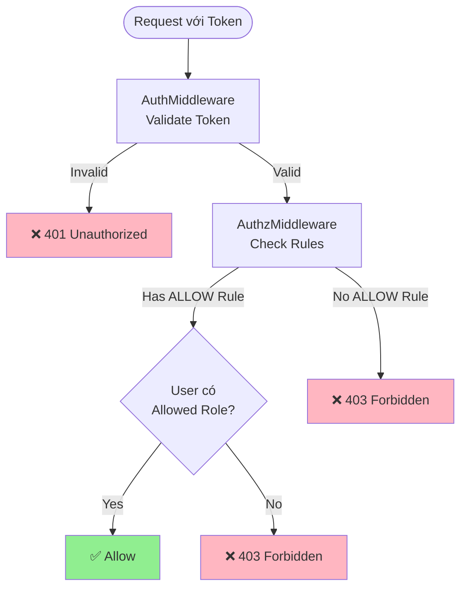
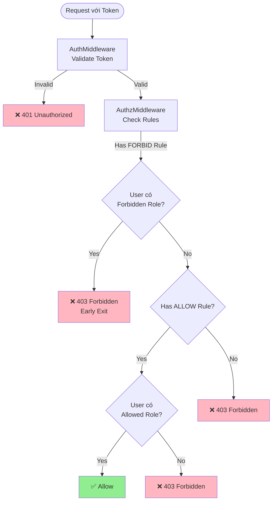
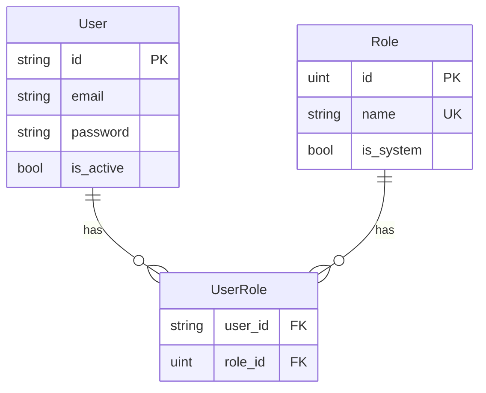
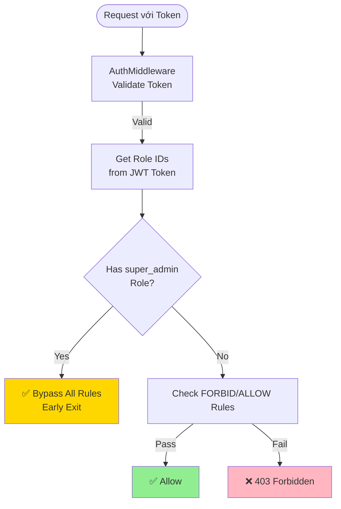
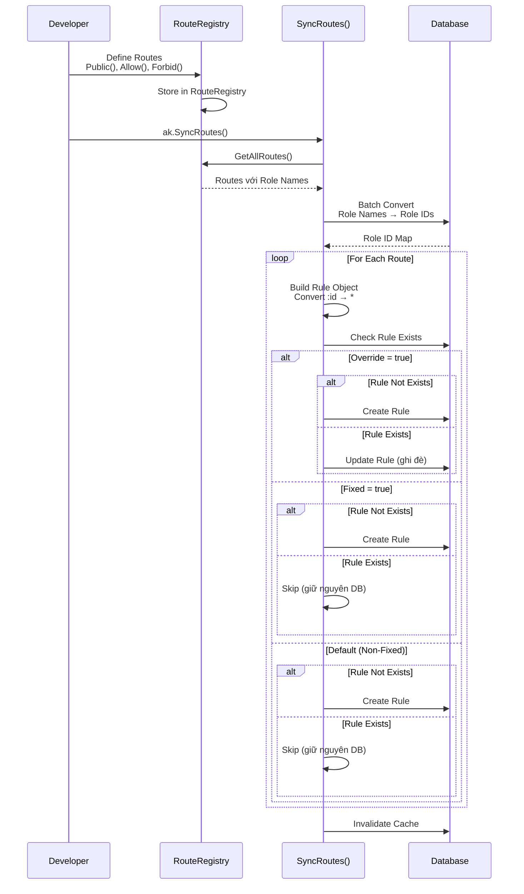

# 4. Hệ thống phân quyền

Tài liệu này mô tả chi tiết về hệ thống phân quyền trong AuthKit, bao gồm rule-based authorization, các loại access type, role management và route sync.

> 📝 **Lưu ý**: Tài liệu này tập trung vào **cấu trúc và cách sử dụng** hệ thống phân quyền. Để hiểu về **luồng xử lý và bảo mật**, xem [3. Middleware và Security](./03-middleware-security.md).

---

## 4.1. Rule-based Authorization

Hệ thống phân quyền của AuthKit dựa trên **Rule-based Authorization** - mỗi endpoint được bảo vệ bởi một hoặc nhiều rules định nghĩa ai được phép truy cập.

### 4.1.1. Rule Model

Rule là đơn vị cơ bản của hệ thống phân quyền, đại diện cho một authorization policy cho một endpoint cụ thể.

```go
type Rule struct {
    ID          string     // Format: "METHOD|PATH" (ví dụ: "GET|/api/users")
    Method      string     // HTTP method: GET, POST, PUT, DELETE, etc.
    Path        string     // URL path pattern (hỗ trợ wildcard *)
    Type        AccessType // PUBLIC, ALLOW, FORBID
    Roles       IntArray   // Array of role IDs (PostgreSQL integer[])
    Fixed       bool       // Fixed=true: rule từ code, không thể sửa từ DB
    Description string     // Mô tả rule
    ServiceName string     // Service name cho microservice isolation (empty = single-app mode)
}
```

**Đặc điểm quan trọng:**

1. **ID Format**: `"METHOD|PATH"` - unique identifier cho rule
   - Ví dụ: `"GET|/api/users"`, `"POST|/api/blogs"`
   - Được tự động generate từ `Method` và `Path` khi tạo rule

2. **Path Pattern**: Hỗ trợ wildcard `*` để match nhiều paths
   - `GET|/api/users/*` matches `GET|/api/users/123`, `GET|/api/users/456`
   - Path parameters (`:id`) được tự động convert thành `*` khi sync vào DB

3. **Roles Storage**: Lưu dưới dạng PostgreSQL `integer[]` (array of role IDs)
   - Role names (string) được convert thành role IDs (uint) khi sync vào DB
   - Tối ưu hiệu suất: so sánh IDs thay vì names

4. **Service Name**: Tối đa 20 ký tự, dùng để tách biệt rules giữa các services
   - Single-app mode: `service_name = NULL` hoặc empty → load tất cả rules
   - Microservice mode: `service_name = "A"` → chỉ load rules có `service_name = "A"`
   - Repository tự động filter theo `service_name` khi load cache

### 4.1.2. Rule Matching Algorithm

Authorization Middleware tìm rules phù hợp với request theo thứ tự ưu tiên:



**Chi tiết:**

1. **Exact Match (O(1) lookup)** ⚡
   - Tìm rule với key chính xác `"METHOD|PATH"`
   - Ví dụ: Request `GET /api/users` → Lookup `"GET|/api/users"`
   - Nếu tìm thấy → return ngay (không cần check patterns)

2. **Pattern Match (Wildcard)** 🔍
   - Chỉ check nếu không có exact match
   - Tối ưu: Filter theo method trước, sau đó filter theo segment count
   - So sánh từng segment: `*` matches bất kỳ segment nào

**Ví dụ Pattern Matching:**

```
Request: GET /api/blogs/123/comments
Pattern: GET|/api/blogs/*/comments → ✅ Match

Request: GET /api/users/456
Pattern: GET|/api/users/* → ✅ Match

Request: GET /api/users/456/posts
Pattern: GET|/api/users/* → ❌ No Match (khác số segments)
```

### 4.1.3. Multiple Rules cho cùng Endpoint

Một endpoint có thể có nhiều rules (ví dụ: cả FORBID và ALLOW rules):

```go
// Rule 1: Cấm role "guest"
Rule {
    ID: "GET|/api/blogs",
    Type: FORBID,
    Roles: [guest_id]
}

// Rule 2: Cho phép role "reader", "author"
Rule {
    ID: "GET|/api/blogs",
    Type: ALLOW,
    Roles: [reader_id, author_id]
}
```

**Evaluation Order** (xem chi tiết trong [3.2.3. Rule Evaluation Order](./03-middleware-security.md#323-rule-evaluation-order)):
1. PUBLIC → Early exit
2. super_admin → Bypass tất cả
3. FORBID → Kiểm tra trước (ưu tiên cao)
4. ALLOW → Kiểm tra sau

---

## 4.2. Các loại Access Type

AuthKit hỗ trợ 3 loại access type để định nghĩa authorization policy:

### 4.2.1. PUBLIC - Route công khai

**Đặc điểm:**
- ✅ Cho phép anonymous users (không cần authentication)
- ✅ Early exit trong authorization middleware
- ✅ Không áp dụng authentication middleware

**Khi nào sử dụng:**
- Login, Register endpoints
- Public API endpoints (ví dụ: danh sách blog công khai)
- Static files, favicon

**Ví dụ sử dụng:**

```go
// Login endpoint - không cần đăng nhập
apiRouter.Post("/auth/login", authHandler.Login).
    Public().
    Description("Đăng nhập người dùng").
    Register()

// Danh sách blog công khai
apiRouter.Get("/blogs", blogHandler.List).
    Public().
    Description("Danh sách blog công khai").
    Register()
```

**Luồng xử lý:**



### 4.2.2. ALLOW - Cho phép các roles cụ thể

**Đặc điểm:**
- 🔐 Yêu cầu authentication (phải có JWT token hợp lệ)
- 👥 Nếu roles rỗng: Mọi user đã đăng nhập đều được
- 🎯 Nếu có roles: Chỉ các roles được chỉ định mới được phép

**Khi nào sử dụng:**
- Protected endpoints cần authentication
- Endpoints chỉ dành cho một số roles cụ thể

**Ví dụ sử dụng:**

```go
// Cho phép mọi user đã đăng nhập
apiRouter.Get("/auth/profile", authHandler.GetProfile).
    Allow().  // Không truyền roles = mọi user đã đăng nhập
    Description("Lấy thông tin profile").
    Register()

// Chỉ cho phép admin và editor
apiRouter.Post("/blogs", blogHandler.Create).
    Allow("admin", "editor").
    Description("Tạo blog mới").
    Register()

// Chỉ cho phép author, editor, admin
apiRouter.Put("/blogs/:id", blogHandler.Update).
    Allow("author", "editor", "admin").
    Description("Cập nhật blog").
    Register()
```

**Luồng xử lý:**



**Lưu ý quan trọng:**

- **Roles rỗng** (`Allow()`) = Mọi user đã đăng nhập đều được
- **Có roles** (`Allow("admin", "editor")`) = Chỉ các roles này được phép
- User chỉ cần có **một trong các roles** được chỉ định là đủ

### 4.2.3. FORBID - Cấm các roles cụ thể

**Đặc điểm:**
- 🔐 Yêu cầu authentication (phải có JWT token hợp lệ)
- 🚫 Cấm các roles được chỉ định
- ⚠️ **Ưu tiên cao hơn ALLOW** - nếu user có role bị FORBID → từ chối ngay

**Khi nào sử dụng:**
- Cấm một số roles cụ thể (ví dụ: cấm guest users)
- Kết hợp với ALLOW để tạo policy phức tạp

**Ví dụ sử dụng:**

```go
// Cấm role "guest" - chỉ các roles khác được phép
apiRouter.Delete("/blogs/:id", blogHandler.Delete).
    Forbid("guest").
    Description("Xóa blog (cấm guest)").
    Register()

// Kết hợp FORBID và ALLOW:
// - FORBID: Cấm guest
// - ALLOW: Chỉ admin và editor được phép
// → Kết quả: Chỉ admin và editor được phép (guest bị cấm)
```

**Luồng xử lý:**



**Lưu ý quan trọng:**

- **FORBID có ưu tiên cao hơn ALLOW** - kiểm tra FORBID trước
- Nếu user có role bị FORBID → từ chối ngay (không check ALLOW)
- Nếu user không có role bị FORBID → tiếp tục check ALLOW

---

## 4.3. Role và User-Role Relationship

### 4.3.1. Role Model

Role đại diện cho một nhóm quyền trong hệ thống:

```go
type BaseRole struct {
    ID     uint   // Integer ID (primary key)
    Name   string // Unique role name (ví dụ: "admin", "editor")
    System bool   // System role không thể xóa
}
```

**Đặc điểm:**

1. **Role ID**: Integer ID được lưu trong database và JWT token
2. **Role Name**: String identifier (ví dụ: "admin", "editor", "super_admin")
3. **System Role**: `System = true` → không thể xóa (bảo vệ roles quan trọng)

**Ví dụ roles trong hệ thống:**

```go
// System roles (không thể xóa)
Role { ID: 1, Name: "super_admin", System: true }
Role { ID: 2, Name: "admin", System: true }

// Custom roles (có thể xóa)
Role { ID: 3, Name: "editor", System: false }
Role { ID: 4, Name: "author", System: false }
Role { ID: 5, Name: "reader", System: false }
Role { ID: 6, Name: "guest", System: false }
```

### 4.3.2. User-Role Relationship (Many-to-Many)

Một user có thể có nhiều roles, một role có thể được gán cho nhiều users:



**Database Schema:**

```sql
-- Junction table
CREATE TABLE user_roles (
    user_id VARCHAR(12) NOT NULL,
    role_id INTEGER NOT NULL,
    PRIMARY KEY (user_id, role_id),
    FOREIGN KEY (user_id) REFERENCES users(id),
    FOREIGN KEY (role_id) REFERENCES roles(id)
);
```

**Ví dụ:**

```
User "abc123" có roles: [admin, editor]
User "def456" có roles: [author, reader]
Role "admin" được gán cho: [user_abc123, user_xyz789]
```

**GORM Relationship:**

```go
// BaseUser
type BaseUser struct {
    // ...
    Roles []BaseRole `gorm:"many2many:user_roles;..."`
}

// BaseRole
type BaseRole struct {
    // ...
    Users []BaseUser `gorm:"many2many:user_roles;..."`
}
```

### 4.3.3. super_admin Role - Role đặc biệt

`super_admin` là role đặc biệt với quyền **bypass hoàn toàn** tất cả rules.

**Đặc điểm:**

1. **Bypass tất cả rules** ⭐
   - Nếu user có role `super_admin` → bypass tất cả logic authorization
   - Early exit trong authorization middleware
   - Không cần check FORBID hay ALLOW rules

2. **Bảo mật cao** 🔒
   - Không thể tạo qua API (bị từ chối với 403)
   - Không thể gán/gỡ qua REST API (phải làm trực tiếp trong database)
   - Phải có `System = true`
   - ID được cache để O(1) check

3. **Use cases** 🎯
   - System administrators
   - Emergency access
   - Audit accounts
   - Bypass các rules bị lỗi

**Luồng xử lý:**



**Lưu ý:**

- `super_admin` chỉ bypass authorization, **không bypass authentication**
- User vẫn cần có JWT token hợp lệ
- Role ID được cache để tối ưu hiệu suất (không cần query DB)

---

## 4.4. Route Sync và Rule Management

### 4.4.1. SyncRoutes() - Đồng bộ Routes từ Code vào Database

`SyncRoutes()` là hàm quan trọng để đồng bộ routes được định nghĩa trong code vào database.

**Luồng xử lý:**



**Chi tiết xử lý:**

1. **Lấy tất cả routes** từ RouteRegistry
2. **Batch convert role names → role IDs** (tối ưu - một query duy nhất)
3. **Convert path parameters** (`:id`) thành wildcard (`*`) để pattern matching
4. **Tạo Rule objects** với role IDs
5. **Xử lý Fixed và Override rules**:
   - `Override = true`: Luôn ghi đè cấu hình từ code lên database (tạo mới hoặc update)
   - `Fixed = true`: Chỉ tạo mới nếu chưa tồn tại, **không update** nếu đã có
   - `Fixed = false` và `Override = false`: Chỉ tạo mới nếu chưa tồn tại, giữ nguyên nếu đã có (để user có thể sửa từ DB)

**Ví dụ:**

```go
// Trong code
apiRouter.Get("/blogs/:id", blogHandler.GetByID).
    Allow("reader", "author", "editor", "admin").
    Fixed().
    Register()

// Sau khi SyncRoutes():
// Rule trong DB:
// {
//   ID: "GET|/api/blogs/*",
//   Method: "GET",
//   Path: "/api/blogs/*",  // :id đã được convert thành *
//   Type: "ALLOW",
//   Roles: [3, 4, 5, 2],  // reader_id, author_id, editor_id, admin_id
//   Fixed: true
// }
```

**Code minh họa:**

```go
// SyncRoutesToDatabase đồng bộ routes từ code vào database
func SyncRoutesToDatabase(
    registry *RouteRegistry,
    ruleRepo *repository.RuleRepository,
    roleRepo *repository.RoleRepository,
) error {
    routes := registry.GetAllRoutes()

    // Batch convert role names → role IDs (tối ưu)
    roleNameSet := make(map[string]bool)
    for _, route := range routes {
        for _, roleName := range route.Roles {
            roleNameSet[roleName] = true
        }
    }
    roleNames := make([]string, 0, len(roleNameSet))
    for roleName := range roleNameSet {
        roleNames = append(roleNames, roleName)
    }
    roleNameToIDMap, err := roleRepo.GetIDsByNames(roleNames)
    // ...

    // Convert và tạo rules
    for _, route := range routes {
        ruleID := fmt.Sprintf("%s|%s", route.Method, route.FullPath)
        
        // Convert role names to role IDs
        roleIDs := make([]uint, 0, len(route.Roles))
        for _, roleName := range route.Roles {
            if roleID, exists := roleNameToIDMap[roleName]; exists {
                roleIDs = append(roleIDs, roleID)
            }
        }

        rule := &models.Rule{
            ID:          ruleID,
            Method:      route.Method,
            Path:        route.FullPath, // Đã được convert :id → *
            Type:        route.AccessType,
            Roles:       models.FromUintSlice(roleIDs),
            Fixed:       route.Fixed,
            Description: route.Description,
        }

        existingRule, err := ruleRepo.GetByID(ruleID)
        if err == gorm.ErrRecordNotFound {
            // Rule chưa tồn tại, tạo mới
            ruleRepo.Create(rule)
        } else if route.Override {
            // Override=true: luôn ghi đè từ code lên DB
            ruleRepo.Update(rule)
        } else if route.Fixed {
            // Fixed=true: chỉ tạo mới, không update
            // (đã xử lý ở trên khi err == gorm.ErrRecordNotFound)
        } else {
            // Default: chỉ tạo mới, giữ nguyên nếu đã tồn tại
            // (đã xử lý ở trên khi err == gorm.ErrRecordNotFound)
        }
    }
}
```

### 4.4.2. Fixed Rules và Override Rules

AuthKit hỗ trợ 3 loại rules dựa trên cách xử lý khi sync vào database:

#### 4.4.2.1. Fixed Rules - Rules không thể thay đổi từ Database

**Fixed Rules** là rules được đánh dấu `Fixed = true`, không thể cập nhật hoặc xóa thông qua API.

**Đặc điểm:**

1. **Không thể update/delete qua API** 🔒
   - `PUT /api/rules/:id` → Reject nếu `Fixed = true`
   - `DELETE /api/rules/:id` → Reject nếu `Fixed = true`

2. **Chỉ tạo mới khi sync** 📝
   - `SyncRoutes()` chỉ tạo mới nếu chưa tồn tại
   - Nếu đã tồn tại → giữ nguyên (không update)

3. **Use cases** 🎯
   - Critical endpoints cần bảo vệ
   - Admin endpoints
   - System endpoints

**Ví dụ:**

```go
// Fixed rule - không thể sửa từ DB
apiRouter.Get("/admin/users", adminHandler.ListUsers).
    Allow("admin").
    Fixed().  // Đánh dấu là fixed
    Description("Danh sách users (chỉ admin)").
    Register()
```

#### 4.4.2.2. Override Rules - Luôn ghi đè từ Code

**Override Rules** là rules được đánh dấu `Override = true`, luôn được ghi đè từ code lên database khi sync.

**Đặc điểm:**

1. **Luôn ghi đè khi sync** 🔄
   - `SyncRoutes()` sẽ update rule nếu đã tồn tại trong DB
   - Đảm bảo cấu hình trong code luôn được áp dụng

2. **Có thể update/delete qua API** ✅
   - `PUT /api/rules/:id` → Cho phép update
   - `DELETE /api/rules/:id` → Cho phép delete
   - Nhưng khi sync lại, cấu hình từ code sẽ được ghi đè

3. **Use cases** 🎯
   - Endpoints cần đảm bảo cấu hình từ code luôn được áp dụng
   - Khi muốn code là source of truth cho rule configuration
   - Development/testing environments

**Ví dụ:**

```go
// Override rule - luôn ghi đè từ code lên DB
apiRouter.Put("/blogs/:id", blogHandler.Update).
    Allow("author", "editor", "admin").
    Override().  // Luôn update rule trong DB khi sync
    Description("Cập nhật blog").
    Register()
```

#### 4.4.2.3. Non-Fixed Rules (Default)

**Non-Fixed Rules** là rules mặc định (`Fixed = false`, `Override = false`), có thể được quản lý từ cả code và database.

**Đặc điểm:**

1. **Chỉ tạo mới khi sync** 📝
   - `SyncRoutes()` chỉ tạo mới nếu chưa tồn tại
   - Nếu đã tồn tại → giữ nguyên (không update)

2. **Có thể update/delete qua API** ✅
   - `PUT /api/rules/:id` → Cho phép update
   - `DELETE /api/rules/:id` → Cho phép delete
   - Thay đổi từ DB sẽ được giữ nguyên khi sync lại

3. **Use cases** 🎯
   - Flexible endpoints cho phép điều chỉnh từ database
   - Dynamic rule management
   - User-configurable permissions

**Ví dụ:**

```go
// Non-fixed rule - có thể sửa từ DB
apiRouter.Post("/blogs", blogHandler.Create).
    Allow("author", "editor").
    // Không có Fixed() hoặc Override() → có thể sửa từ DB
    Description("Tạo blog mới").
    Register()
```

**Lưu ý quan trọng:**

- ⚠️ **Fixed và Override loại trừ lẫn nhau** - không thể dùng cùng lúc
- Nếu gọi cả `Fixed()` và `Override()`, method được gọi sau sẽ override method trước
- Trong code: `Fixed()` sẽ set `Override = false`, `Override()` sẽ set `Fixed = false`

**So sánh 3 loại Rules:**

| Đặc điểm | Fixed Rule | Override Rule | Non-Fixed Rule |
|----------|------------|---------------|----------------|
| Tạo từ code | ✅ Có thể | ✅ Có thể | ✅ Có thể |
| Update từ DB | ❌ Không thể | ✅ Có thể (nhưng sẽ bị ghi đè khi sync) | ✅ Có thể |
| Delete từ DB | ❌ Không thể | ✅ Có thể (nhưng sẽ được tạo lại khi sync) | ✅ Có thể |
| SyncRoutes() | Chỉ tạo mới | Tạo mới hoặc update | Chỉ tạo mới |
| Use case | Critical endpoints | Code là source of truth | Flexible endpoints |

### 4.4.3. Rule Management API

AuthKit cung cấp REST API để quản lý rules (CRUD operations):

**Endpoints:**

```http
GET    /api/rules          # List tất cả rules
POST   /api/rules          # Tạo rule mới
PUT    /api/rules/:id      # Update rule (reject nếu Fixed=true)
DELETE /api/rules/:id      # Xóa rule (reject nếu Fixed=true)
```

**Ví dụ sử dụng:**

```bash
# List tất cả rules
curl -X GET http://localhost:3000/api/rules \
  -H "Authorization: Bearer <token>"

# Tạo rule mới
curl -X POST http://localhost:3000/api/rules \
  -H "Authorization: Bearer <token>" \
  -H "Content-Type: application/json" \
  -d '{
    "method": "GET",
    "path": "/api/custom-endpoint",
    "type": "ALLOW",
    "roles": [3, 4],
    "description": "Custom endpoint"
  }'

# Update rule (chỉ non-fixed)
curl -X PUT http://localhost:3000/api/rules/GET|/api/custom-endpoint \
  -H "Authorization: Bearer <token>" \
  -H "Content-Type: application/json" \
  -d '{
    "type": "FORBID",
    "roles": [6]
  }'

# Xóa rule (chỉ non-fixed)
curl -X DELETE http://localhost:3000/api/rules/GET|/api/custom-endpoint \
  -H "Authorization: Bearer <token>"
```

**Cache Invalidation:**

Sau khi tạo/update/delete rule qua API, cache sẽ được invalidate tự động:

```go
// Trong RuleHandler
func (h *RuleHandler) AddRule(c *fiber.Ctx) error {
    // ... tạo rule ...
    
    // Invalidate cache sau khi thêm rule
    h.authorizationMiddleware.InvalidateCache()
    
    return c.JSON(...)
}
```

---

## 4.5. Tóm tắt và Best Practices

### ✅ Best Practices

1. **Sử dụng Fixed() cho critical endpoints**
   - Admin endpoints
   - System endpoints
   - Endpoints quan trọng cần bảo vệ

2. **Sử dụng Override() khi cần đảm bảo code là source of truth**
   - Endpoints cần luôn đồng bộ cấu hình từ code
   - Development/testing environments
   - Khi muốn code luôn ghi đè thay đổi từ database

2. **Kết hợp FORBID và ALLOW khi cần**
   - FORBID để cấm một số roles
   - ALLOW để chỉ định roles được phép

3. **Sử dụng PUBLIC cho endpoints không cần authentication**
   - Login, Register
   - Public APIs
   - Static files

4. **Sync routes sau khi thay đổi**
   - Gọi `ak.SyncRoutes()` sau khi thêm/sửa routes trong code
   - Đảm bảo database đồng bộ với code

5. **Sử dụng Description() để mô tả rules**
   - Giúp dễ hiểu và maintain
   - Hiển thị trong API `/api/rules`

### ⚠️ Lưu ý

1. **Role Names vs Role IDs**
   - Trong code: sử dụng role names (string)
   - Trong DB: lưu role IDs (integer[])
   - Conversion tự động khi sync

2. **Path Parameters**
   - `:id` được tự động convert thành `*` khi sync
   - Pattern matching hỗ trợ wildcard `*`

3. **Multiple Rules**
   - Một endpoint có thể có nhiều rules
   - Evaluation order: PUBLIC → super_admin → FORBID → ALLOW

4. **Cache**
   - Rules được cache để tối ưu hiệu suất
   - Cache được invalidate sau khi sync routes hoặc update rules

---

**Xem thêm:**
- [3. Middleware và Security](./03-middleware-security.md) - Luồng xử lý authorization và bảo mật
- [5. Database Schema và Models](./05-database-schema-models.md) - Chi tiết về database schema
- [7. Cơ chế hoạt động chi tiết](./07-co-che-hoat-dong-chi-tiet.md) - JWT token generation và rule matching algorithm
- [8. Tích hợp và Sử dụng](./08-tich-hop-su-dung.md) - Hướng dẫn tích hợp và sử dụng
- [Mục lục](./README.md)
