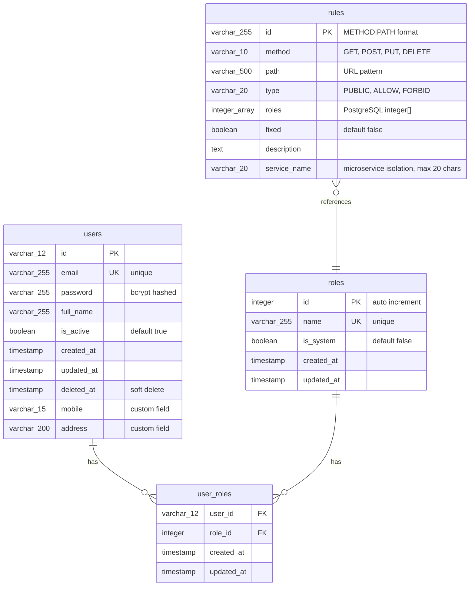
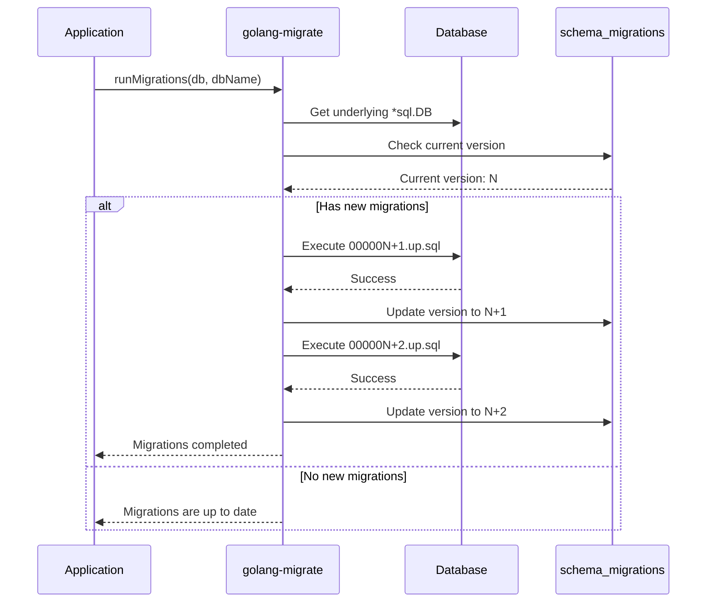
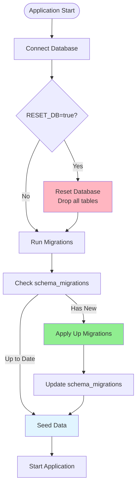
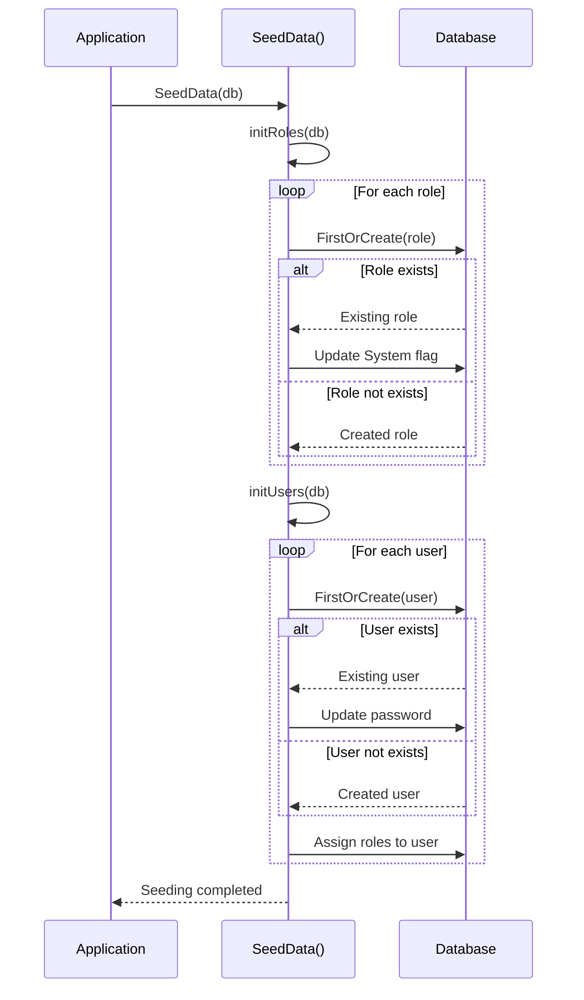
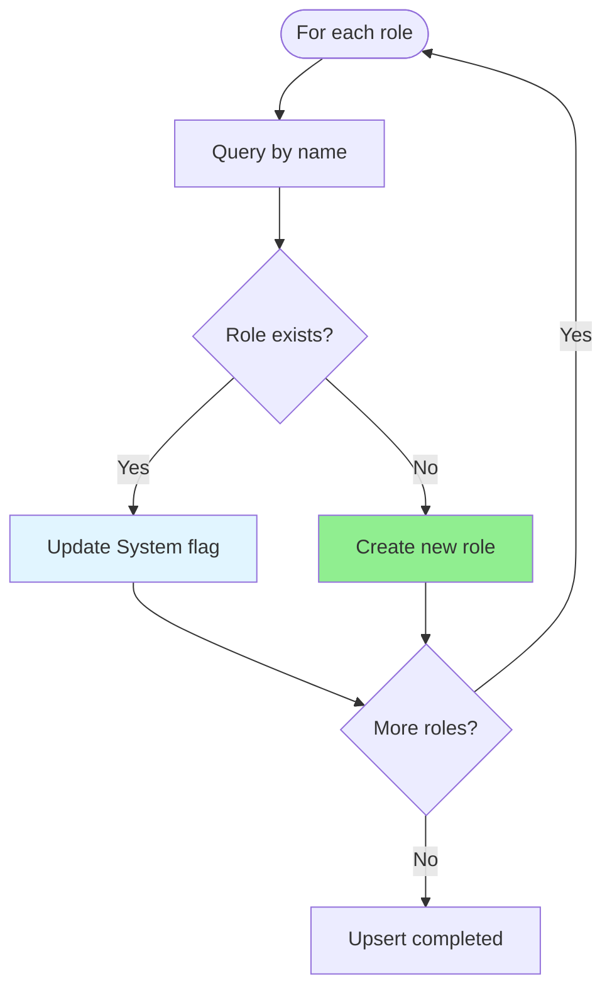

# 5. Database Schema và Models

Tài liệu này mô tả chi tiết về database schema, các models, và các cơ chế quản lý database trong AuthKit (migrations, seeding, upsert).

> 📖 **Trước khi đọc**: Để hiểu cách models được sử dụng với Generic Types, xem [6. Generic Types và Extensibility](./06-generic-types-extensibility.md).

---

## 5.1. ER Diagram - Tổng quan Database Schema

Sơ đồ quan hệ giữa các bảng trong AuthKit:



**Quan hệ giữa các bảng:**

1. **Users ↔ Roles**: Many-to-many qua `user_roles` junction table
2. **Rules → Roles**: Rules chứa array of role IDs (không phải foreign key, chỉ reference)
3. **Cascading**: 
   - `ON DELETE CASCADE` cho `user_roles` khi xóa user hoặc role
   - Soft delete cho `users` (không xóa thật, chỉ đánh dấu `deleted_at`)

---

## 5.2. Chi tiết từng bảng

### 5.2.1. Users Table

**Table name**: `users`

**Schema:**

```sql
CREATE TABLE users (
    id VARCHAR(12) PRIMARY KEY,
    email VARCHAR(255) NOT NULL UNIQUE,
    password VARCHAR(255) NOT NULL,
    full_name VARCHAR(255),
    is_active BOOLEAN DEFAULT TRUE,
    created_at TIMESTAMP NOT NULL DEFAULT CURRENT_TIMESTAMP,
    updated_at TIMESTAMP NOT NULL DEFAULT CURRENT_TIMESTAMP,
    deleted_at TIMESTAMP NULL,
    -- Custom fields (có thể thêm khi embed BaseUser)
    mobile VARCHAR(15),
    address VARCHAR(200)
);

-- Indexes
CREATE INDEX idx_users_deleted_at ON users(deleted_at);
CREATE UNIQUE INDEX idx_users_email ON users(email);
```

**Fields chi tiết:**

| Field | Type | Constraints | Mô tả |
|-------|------|-------------|-------|
| `id` | VARCHAR(12) | PRIMARY KEY | Auto-generated với `utils.GenerateID()` |
| `email` | VARCHAR(255) | UNIQUE, NOT NULL | Email của user (unique) |
| `password` | VARCHAR(255) | NOT NULL | Password đã hash bằng bcrypt |
| `full_name` | VARCHAR(255) | NULL | Tên đầy đủ của user |
| `is_active` | BOOLEAN | DEFAULT TRUE | Trạng thái active (false = bị vô hiệu hóa) |
| `created_at` | TIMESTAMP | NOT NULL | Thời gian tạo |
| `updated_at` | TIMESTAMP | NOT NULL | Thời gian cập nhật |
| `deleted_at` | TIMESTAMP | NULL | Soft delete (GORM) |
| `mobile` | VARCHAR(15) | NULL | Số điện thoại (custom field) |
| `address` | VARCHAR(200) | NULL | Địa chỉ (custom field) |

**Đặc điểm:**

- ✅ **Soft Delete**: Sử dụng `deleted_at` để đánh dấu xóa, không xóa thật
- ✅ **Custom Fields**: Có thể thêm fields tùy chỉnh khi embed `BaseUser` (ví dụ: `mobile`, `address`)
- ✅ **Auto ID**: ID được tự động generate bằng `utils.GenerateID()` trong `BeforeCreate` hook

**Model trong Go:**

```go
type BaseUser struct {
    ID        string         `gorm:"type:varchar(12);primary_key"`
    Email     string         `gorm:"uniqueIndex;not null"`
    Password  string         `gorm:"not null" json:"-"` // Hidden from JSON
    FullName  string
    Active    bool           `gorm:"column:is_active;default:true"`
    CreatedAt time.Time
    UpdatedAt time.Time
    DeletedAt gorm.DeletedAt `gorm:"index"`
    
    // Relationships
    Roles []BaseRole `gorm:"many2many:user_roles;..."`
}
```

### 5.2.2. Roles Table

**Table name**: `roles`

**Schema:**

```sql
CREATE TABLE roles (
    id INTEGER PRIMARY KEY,
    name VARCHAR(255) NOT NULL UNIQUE,
    is_system BOOLEAN DEFAULT FALSE,
    created_at TIMESTAMP NOT NULL DEFAULT CURRENT_TIMESTAMP,
    updated_at TIMESTAMP NOT NULL DEFAULT CURRENT_TIMESTAMP
);
```

**Fields chi tiết:**

| Field | Type | Constraints | Mô tả |
|-------|------|-------------|-------|
| `id` | INTEGER | PRIMARY KEY | Auto increment ID |
| `name` | VARCHAR(255) | UNIQUE, NOT NULL | Tên role (ví dụ: "admin", "editor") |
| `is_system` | BOOLEAN | DEFAULT FALSE | System role không thể xóa |
| `created_at` | TIMESTAMP | NOT NULL | Thời gian tạo |
| `updated_at` | TIMESTAMP | NOT NULL | Thời gian cập nhật |

**Đặc điểm:**

- ✅ **System Roles**: Roles với `is_system = true` không thể xóa qua API
- ✅ **Fixed IDs**: System roles thường có ID cố định (ví dụ: `super_admin` = 1)
- ✅ **Unique Name**: Tên role phải unique trong hệ thống

**Model trong Go:**

```go
type BaseRole struct {
    ID     uint   `gorm:"primaryKey"`
    Name   string `gorm:"uniqueIndex;not null"`
    System bool   `gorm:"column:is_system;default:false"`
    
    // Relationships
    Users []BaseUser `gorm:"many2many:user_roles;..."`
}
```

**Default Roles:**

| ID | Name | System | Mô tả |
|----|------|---------|-------|
| 1 | `super_admin` | ✅ | Bypass tất cả rules |
| 2 | `admin` | ✅ | Quản trị viên |
| 3 | `editor` | ❌ | Biên tập viên |
| 4 | `author` | ❌ | Tác giả |
| 5 | `reader` | ❌ | Người đọc |

### 5.2.3. User_Roles Table (Many-to-Many)

**Table name**: `user_roles`

**Schema:**

```sql
CREATE TABLE user_roles (
    user_id VARCHAR(12) NOT NULL,
    role_id INTEGER NOT NULL,
    created_at TIMESTAMP NOT NULL DEFAULT CURRENT_TIMESTAMP,
    updated_at TIMESTAMP NOT NULL DEFAULT CURRENT_TIMESTAMP,
    PRIMARY KEY (user_id, role_id),
    CONSTRAINT fk_user_roles_user FOREIGN KEY (user_id) 
        REFERENCES users(id) ON DELETE CASCADE,
    CONSTRAINT fk_user_roles_role FOREIGN KEY (role_id) 
        REFERENCES roles(id) ON DELETE CASCADE
);

-- Indexes for better query performance
CREATE INDEX idx_user_roles_user_id ON user_roles(user_id);
CREATE INDEX idx_user_roles_role_id ON user_roles(role_id);
```

**Fields chi tiết:**

| Field | Type | Constraints | Mô tả |
|-------|------|-------------|-------|
| `user_id` | VARCHAR(12) | FOREIGN KEY → users.id | ID của user |
| `role_id` | INTEGER | FOREIGN KEY → roles.id | ID của role |
| `created_at` | TIMESTAMP | NOT NULL | Thời gian gán role |
| `updated_at` | TIMESTAMP | NOT NULL | Thời gian cập nhật |

**Đặc điểm:**

- ✅ **Composite Primary Key**: `(user_id, role_id)` đảm bảo một user không thể có cùng role hai lần
- ✅ **Cascade Delete**: Khi xóa user hoặc role, các records trong `user_roles` sẽ tự động xóa
- ✅ **Indexes**: Có indexes trên cả `user_id` và `role_id` để tối ưu queries

**Ví dụ dữ liệu:**

```
user_id    | role_id | created_at
-----------|---------|------------
abc123xyz  | 1       | 2024-01-01  (super_admin)
abc123xyz  | 2       | 2024-01-01  (admin)
def456uvw  | 3       | 2024-01-02  (editor)
def456uvw  | 4       | 2024-01-02  (author)
```

### 5.2.4. Rules Table

**Table name**: `rules`

**Schema:**

```sql
CREATE TABLE rules (
    id VARCHAR(255) PRIMARY KEY,
    method VARCHAR(10) NOT NULL,
    path VARCHAR(500) NOT NULL,
    type VARCHAR(20) NOT NULL,
    roles INTEGER[] DEFAULT '{}',
    fixed BOOLEAN DEFAULT FALSE,
    description TEXT,
    service_name VARCHAR(20)  -- For microservice isolation (NULL = single-app mode)
);

-- Indexes for faster lookups
CREATE INDEX idx_rules_method_path ON rules(method, path);
CREATE INDEX idx_rules_service_name ON rules(service_name);

-- Partial unique indexes for microservice support
-- Single-app mode: unique (method, path) when service_name IS NULL
CREATE UNIQUE INDEX idx_method_path_null_service 
    ON rules(method, path) 
    WHERE service_name IS NULL;

-- Microservice mode: unique (service_name, method, path) when service_name IS NOT NULL
CREATE UNIQUE INDEX idx_service_method_path 
    ON rules(service_name, method, path) 
    WHERE service_name IS NOT NULL;
```

**Fields chi tiết:**

| Field | Type | Constraints | Mô tả |
|-------|------|-------------|-------|
| `id` | VARCHAR(255) | PRIMARY KEY | Format: `"METHOD|PATH"` (ví dụ: `"GET|/api/users"`) |
| `method` | VARCHAR(10) | NOT NULL | HTTP method (GET, POST, PUT, DELETE, etc.) |
| `path` | VARCHAR(500) | NOT NULL | URL path pattern (hỗ trợ wildcard `*`) |
| `type` | VARCHAR(20) | NOT NULL | Access type: `PUBLIC`, `ALLOW`, `FORBID` |
| `roles` | INTEGER[] | DEFAULT '{}' | PostgreSQL array of role IDs |
| `fixed` | BOOLEAN | DEFAULT FALSE | Fixed rules không thể sửa từ DB |
| `description` | TEXT | NULL | Mô tả rule |
| `service_name` | VARCHAR(20) | NULL, INDEXED | Service name cho microservice isolation (NULL = single-app mode) |

**Đặc điểm:**

- ✅ **ID Format**: `"METHOD|PATH"` (ví dụ: `"GET|/api/users"`, `"POST|/api/blogs/*"`)
- ✅ **PostgreSQL Array**: `roles` là PostgreSQL `integer[]` array, không phải foreign key
- ✅ **Unique Constraints**: 
  - Single-app mode: `(method, path)` unique khi `service_name IS NULL`
  - Microservice mode: `(service_name, method, path)` unique khi `service_name IS NOT NULL`
- ✅ **Fixed Rules**: `fixed = true` → không thể update/delete qua API
- ✅ **Service Name**: Tối đa 20 ký tự, dùng để tách biệt rules giữa các services trong microservice architecture

**Model trong Go:**

```go
type Rule struct {
    ID          string     `gorm:"primaryKey"` // Format: "METHOD|PATH"
    Method      string     `gorm:"not null"`
    Path        string     `gorm:"not null"`
    Type        AccessType `gorm:"type:varchar(20);not null"` // PUBLIC, ALLOW, FORBID
    Roles       IntArray   `gorm:"type:integer[]"` // PostgreSQL integer[]
    Fixed       bool       `gorm:"default:false"`
    Description string     `gorm:"type:text"`
    ServiceName string     `gorm:"type:varchar(20);index"` // Microservice isolation (empty = single-app mode)
}

// IntArray là custom type để handle PostgreSQL integer[]
type IntArray []uint
```

**Ví dụ dữ liệu:**

**Single-app mode** (service_name = NULL):
```
id                    | method | path              | type   | roles    | fixed | description | service_name
----------------------|--------|-------------------|--------|----------|-------|-------------|-------------
GET|/api/auth/login   | GET    | /api/auth/login   | PUBLIC | {}       | true  | Login endpoint | NULL
GET|/api/users        | GET    | /api/users        | ALLOW  | {2,3}    | false | List users     | NULL
```

**Microservice mode** (service_name set):
```
id                    | method | path              | type   | roles    | fixed | description | service_name
----------------------|--------|-------------------|--------|----------|-------|-------------|-------------
GET|/api/admin/users  | GET    | /api/admin/users  | ALLOW  | {1}      | false | Admin users   | A
POST|/api/products    | POST   | /api/products     | ALLOW  | {2,3}    | false | Create product| B
GET|/api/tasks        | GET    | /api/tasks        | ALLOW  | {4}      | false | List tasks    | C
```

---

## 5.3. Cơ chế Migration (Up/Down)

AuthKit sử dụng **golang-migrate** để quản lý database migrations với cơ chế **up/down**.

### 5.3.1. Tổng quan Migration

**Migration** là cách quản lý thay đổi database schema theo thời gian:

- ✅ **Version Control**: Mỗi migration có version number
- ✅ **Up Migration**: Áp dụng thay đổi (tạo bảng, thêm cột, v.v.)
- ✅ **Down Migration**: Hoàn tác thay đổi (xóa bảng, xóa cột, v.v.)
- ✅ **Tracked**: `schema_migrations` table lưu version đã apply

**File naming convention:**

```
migrations/
├── 000001_create_users_table.up.sql      # Up migration
├── 000001_create_users_table.down.sql    # Down migration
├── 000002_create_roles_table.up.sql
├── 000002_create_roles_table.down.sql
└── ...
```

### 5.3.2. Migration Flow



### 5.3.3. Up Migration - Áp dụng thay đổi

**Up migration** chạy khi:
- Khởi động ứng dụng lần đầu
- Có migrations mới chưa được apply
- Gọi `m.Up()` trong code

**Ví dụ Up Migration:**

```sql
-- 000001_create_users_table.up.sql
CREATE TABLE IF NOT EXISTS users (
    id VARCHAR(12) PRIMARY KEY,
    email VARCHAR(255) NOT NULL UNIQUE,
    password VARCHAR(255) NOT NULL,
    full_name VARCHAR(255),
    is_active BOOLEAN DEFAULT TRUE,
    created_at TIMESTAMP NOT NULL DEFAULT CURRENT_TIMESTAMP,
    updated_at TIMESTAMP NOT NULL DEFAULT CURRENT_TIMESTAMP,
    deleted_at TIMESTAMP NULL
);

CREATE INDEX IF NOT EXISTS idx_users_deleted_at ON users(deleted_at);
```

**Code thực thi:**

```go
// examples/migrations.go
func runMigrations(db *gorm.DB, dbName string) error {
    // Get underlying *sql.DB from GORM
    sqlDB, err := db.DB()
    if err != nil {
        return err
    }

    // Create postgres driver
    driver, err := pgmigrate.WithInstance(sqlDB, &pgmigrate.Config{
        DatabaseName: dbName,
    })

    // Create file source from migrations directory
    sourceDriver, err := iofs.New(os.DirFS("migrations"), ".")

    // Create migrate instance
    m, err := migrate.NewWithInstance("iofs", sourceDriver, "postgres", driver)

    // Run migrations up
    if err := m.Up(); err != nil {
        if err == migrate.ErrNoChange {
            fmt.Println("Migrations are up to date")
            return nil
        }
        return err
    }

    fmt.Println("Migrations completed successfully")
    return nil
}
```

### 5.3.4. Down Migration - Hoàn tác thay đổi

**Down migration** chạy khi:
- Cần rollback về version cũ
- Gọi `m.Down()` trong code
- Debug hoặc development

**Ví dụ Down Migration:**

```sql
-- 000001_create_users_table.down.sql
DROP INDEX IF EXISTS idx_users_deleted_at;
DROP TABLE IF EXISTS users;
```

**Code rollback:**

```go
// Rollback một version
m.Down()

// Rollback về version cụ thể
m.Migrate(2) // Rollback về version 2
```

### 5.3.5. Schema Migrations Table

`golang-migrate` tự động tạo bảng `schema_migrations` để track version:

```sql
CREATE TABLE schema_migrations (
    version BIGINT NOT NULL PRIMARY KEY,
    dirty BOOLEAN NOT NULL
);
```

**Ví dụ dữ liệu:**

```
version | dirty
--------|------
1       | false
2       | false
3       | false
```

- `version`: Version migration hiện tại
- `dirty`: `true` nếu migration bị lỗi giữa chừng (cần fix manual)

### 5.3.6. Luồng Migration trong Application



**Code trong main.go:**

```go
func main() {
    // 1. Connect database
    db, err := gorm.Open(postgres.Open(dsn), &gorm.Config{})
    
    // 2. Reset database (only if RESET_DB=true)
    if err := resetDatabase(db); err != nil {
        panic(err)
    }
    
    // 3. Run migrations
    if err := runMigrations(db, dbName); err != nil {
        panic(err)
    }
    
    // 4. Seed initial data
    if err := SeedData(db); err != nil {
        panic(err)
    }
    
    // 5. Start application
    // ...
}
```

---

## 5.4. Cơ chế Seeding - Khởi tạo dữ liệu ban đầu

**Seeding** là quá trình khởi tạo dữ liệu ban đầu (initial data) vào database sau khi migrations đã chạy.

### 5.4.1. Tổng quan Seeding

**Seeding** được sử dụng để:
- ✅ Tạo roles mặc định (super_admin, admin, editor, v.v.)
- ✅ Tạo users test ban đầu
- ✅ Khởi tạo dữ liệu cần thiết cho ứng dụng

**Khi nào seeding chạy:**
- Sau khi migrations đã hoàn thành
- Mỗi lần khởi động ứng dụng (nếu cần)
- Sử dụng **upsert** để tránh duplicate

### 5.4.2. Seeding Flow



### 5.4.3. Seeding Roles

**Code seeding roles:**

```go
// examples/seed.go
func initRoles(db *gorm.DB) error {
    roles := []struct {
        id     uint
        name   string
        system bool
    }{
        {id: 1, name: "super_admin", system: true},
        {id: 2, name: "admin"},
        {id: 3, name: "editor"},
        {id: 4, name: "author"},
        {id: 5, name: "reader"},
    }

    for _, roleData := range roles {
        role := &authkit.Role{
            ID:     roleData.id,
            Name:   roleData.name,
            System: roleData.system,
        }

        // FirstOrCreate: tìm theo Name, nếu không có thì tạo mới
        result := db.Where("name = ?", roleData.name).FirstOrCreate(role)
        
        if result.Error == nil && result.RowsAffected == 0 {
            // Role đã tồn tại, cập nhật System flag
            role.System = roleData.system
            db.Save(role)
        }
        
        if result.RowsAffected > 0 {
            fmt.Printf("Created role: %s (ID: %d, System: %v)\n", 
                roleData.name, roleData.id, roleData.system)
        }
    }

    return nil
}
```

**Đặc điểm:**

- ✅ **Upsert Pattern**: Sử dụng `FirstOrCreate()` để tránh duplicate
- ✅ **Fixed IDs**: System roles có ID cố định (1, 2, 3, v.v.)
- ✅ **Update System Flag**: Nếu role đã tồn tại, vẫn cập nhật `is_system` flag

### 5.4.4. Seeding Users

**Code seeding users:**

```go
// examples/seed.go
func initUsers(db *gorm.DB) error {
    testUsers := []struct {
        email    string
        password string
        fullName string
        mobile   string
        address  string
        roles    []string
    }{
        {
            email:    "admin@gmail.com",
            password: "123456",
            fullName: "Admin User",
            mobile:   "0901234567",
            address:  "123 Admin Street",
            roles:    []string{"admin"},
        },
        // ... more users
    }

    for _, userData := range testUsers {
        // Hash password
        hashedPassword, err := utils.HashPassword(userData.password)
        
        // Create user object
        user := &CustomUser{
            BaseUser: authkit.BaseUser{
                Email:    userData.email,
                Password: hashedPassword,
                FullName: userData.fullName,
                Active:   true,
            },
            Mobile:  userData.mobile,
            Address: userData.address,
        }

        // FirstOrCreate: tìm theo Email, nếu không có thì tạo mới
        result := db.Where("email = ?", userData.email).FirstOrCreate(user)
        
        if result.RowsAffected == 0 {
            // User đã tồn tại, cập nhật password
            user.Password = hashedPassword
            db.Save(user)
        } else {
            fmt.Printf("Created user: %s\n", userData.email)
        }

        // Assign roles to user
        var roles []authkit.Role
        for _, roleName := range userData.roles {
            var role authkit.Role
            db.Where("name = ?", roleName).First(&role)
            roles = append(roles, role)
        }
        
        // Replace all roles for the user
        db.Model(user).Association("Roles").Replace(roles)
    }

    return nil
}
```

**Đặc điểm:**

- ✅ **Upsert Pattern**: Sử dụng `FirstOrCreate()` để tránh duplicate
- ✅ **Password Update**: Nếu user đã tồn tại, vẫn cập nhật password (để sync với code)
- ✅ **Role Assignment**: Sử dụng `Association().Replace()` để gán roles

### 5.4.5. Luồng Seeding trong Application

```mermaid
flowchart TD
    Start([After Migrations]) --> Seed[SeedData(db)]
    Seed --> InitRoles[initRoles(db)]
    InitRoles --> LoopRoles{For each role}
    LoopRoles --> CheckRole{Role exists?}
    CheckRole -->|Yes| UpdateRole[Update System flag]
    CheckRole -->|No| CreateRole[Create role]
    UpdateRole --> NextRole{More roles?}
    CreateRole --> NextRole
    NextRole -->|Yes| LoopRoles
    NextRole -->|No| InitUsers[initUsers(db)]
    
    InitUsers --> LoopUsers{For each user}
    LoopUsers --> CheckUser{User exists?}
    CheckUser -->|Yes| UpdateUser[Update password]
    CheckUser -->|No| CreateUser[Create user]
    UpdateUser --> AssignRoles[Assign roles]
    CreateUser --> AssignRoles
    AssignRoles --> NextUser{More users?}
    NextUser -->|Yes| LoopUsers
    NextUser -->|No| Complete[Seeding completed]
    
    style InitRoles fill:#E1F5FF
    style InitUsers fill:#E1F5FF
    style Complete fill:#90EE90
```

---

## 5.5. Cơ chế Upsert - Insert hoặc Update

**Upsert** là pattern "insert nếu chưa tồn tại, update nếu đã tồn tại" - rất hữu ích cho seeding và sync data.

### 5.5.1. Tổng quan Upsert

**Upsert** được sử dụng trong:
- ✅ **Seeding**: Khởi tạo dữ liệu ban đầu (không tạo duplicate)
- ✅ **Sync Routes**: Đồng bộ rules từ code vào database
- ✅ **Data Sync**: Đồng bộ dữ liệu giữa các hệ thống

**Pattern trong AuthKit:**

```go
// Pattern 1: FirstOrCreate (GORM)
result := db.Where("email = ?", email).FirstOrCreate(user)
if result.RowsAffected == 0 {
    // Đã tồn tại, có thể update
    db.Save(user)
}

// Pattern 2: Check then Create
_, err := repo.GetByID(id)
if err == gorm.ErrRecordNotFound {
    // Chưa tồn tại, tạo mới
    repo.Create(entity)
} else {
    // Đã tồn tại, bỏ qua hoặc update
}
```

### 5.5.2. Upsert trong Seeding

**Ví dụ: Upsert Roles**

```go
func initRoles(db *gorm.DB) error {
    roles := []struct {
        id     uint
        name   string
        system bool
    }{
        {id: 1, name: "super_admin", system: true},
        {id: 2, name: "admin"},
    }

    for _, roleData := range roles {
        role := &authkit.Role{
            ID:     roleData.id,
            Name:   roleData.name,
            System: roleData.system,
        }

        // Upsert: Tìm theo Name, nếu không có thì tạo mới
        result := db.Where("name = ?", roleData.name).FirstOrCreate(role)
        
        if result.RowsAffected == 0 {
            // Đã tồn tại, cập nhật System flag
            role.System = roleData.system
            db.Save(role)
        }
    }
    
    return nil
}
```

**Luồng xử lý:**



### 5.5.3. Upsert trong Sync Routes

**Ví dụ: Upsert Rules khi sync routes**

```go
// router/sync.go
func SyncRoutesToDatabase(...) error {
    routes := registry.GetAllRoutes()
    
    for _, route := range routes {
        ruleID := fmt.Sprintf("%s|%s", route.Method, route.FullPath)
        
        // Check if rule exists
        _, err := ruleRepo.GetByID(ruleID)
        
        if err == gorm.ErrRecordNotFound {
            // Rule chưa tồn tại, tạo mới
            rule := &models.Rule{
                ID:          ruleID,
                Method:      route.Method,
                Path:        route.FullPath,
                Type:        route.AccessType,
                Roles:       models.FromUintSlice(roleIDs),
                Fixed:       route.Fixed,
                Description: route.Description,
            }
            ruleRepo.Create(rule)
        } else {
            // Rule đã tồn tại, bỏ qua (không update)
            // Để giữ nguyên Type và Roles từ database
        }
    }
    
    return nil
}
```

**Đặc điểm:**

- ✅ **Fixed Rules**: Nếu `Fixed = true`, chỉ tạo mới, không update
- ✅ **Non-Fixed Rules**: Nếu `Fixed = false`, chỉ tạo mới, không update (để user có thể sửa từ DB)
- ✅ **Idempotent**: Có thể chạy nhiều lần mà không tạo duplicate

### 5.5.4. So sánh các Pattern Upsert

| Pattern | Khi nào dùng | Ưu điểm | Nhược điểm |
|---------|--------------|--------|-------------|
| **FirstOrCreate** | Seeding, simple upsert | Đơn giản, GORM hỗ trợ | Không kiểm soát được update logic |
| **Check then Create** | Sync routes, complex logic | Kiểm soát được update logic | Phải query 2 lần (check + create) |
| **ON CONFLICT** (PostgreSQL) | High performance | Nhanh, atomic | Chỉ PostgreSQL, phức tạp hơn |

**Ví dụ ON CONFLICT (PostgreSQL native):**

```sql
-- PostgreSQL native upsert
INSERT INTO roles (id, name, is_system)
VALUES (1, 'super_admin', true)
ON CONFLICT (id) 
DO UPDATE SET is_system = EXCLUDED.is_system;
```

### 5.5.5. Best Practices cho Upsert

1. **Sử dụng FirstOrCreate cho seeding đơn giản**
   ```go
   db.Where("email = ?", email).FirstOrCreate(user)
   ```

2. **Sử dụng Check then Create cho logic phức tạp**
   ```go
   _, err := repo.GetByID(id)
   if err == gorm.ErrRecordNotFound {
       repo.Create(entity)
   }
   ```

3. **Luôn kiểm tra RowsAffected**
   ```go
   result := db.FirstOrCreate(user)
   if result.RowsAffected == 0 {
       // Đã tồn tại, có thể update
   }
   ```

4. **Idempotent operations**
   - Upsert nên idempotent (chạy nhiều lần cho cùng kết quả)
   - Tránh side effects khi chạy lại

---

## 5.6. Tóm tắt và Best Practices

### ✅ Best Practices

1. **Migration Management**
   - Luôn có cả `.up.sql` và `.down.sql`
   - Test migrations trên development trước khi deploy
   - Không sửa migrations đã được apply (tạo migration mới)

2. **Seeding**
   - Sử dụng upsert để tránh duplicate
   - Seed data idempotent (có thể chạy nhiều lần)
   - Không seed sensitive data (passwords từ env vars)

3. **Upsert Pattern**
   - `FirstOrCreate` cho simple cases
   - `Check then Create` cho complex logic
   - Luôn kiểm tra `RowsAffected` để biết create hay update

4. **Database Schema**
   - Sử dụng indexes cho foreign keys và unique constraints
   - Soft delete cho users (không xóa thật)
   - Cascade delete cho junction tables

### ⚠️ Lưu ý

1. **Migration Order**
   - Migrations chạy theo thứ tự version number
   - Không skip versions (phải chạy tuần tự)

2. **Seeding và Production**
   - Không seed test data vào production
   - Sử dụng environment variables cho sensitive data

3. **Upsert và Concurrency**
   - Upsert không đảm bảo atomic nếu không dùng transactions
   - Cân nhắc sử dụng database-level upsert (ON CONFLICT) cho high concurrency

---

**Xem thêm:**
- [2. Kiến trúc tổng thể](./02-kien-truc-tong-the.md) - Hiểu cách database tích hợp vào kiến trúc
- [4. Hệ thống phân quyền](./04-he-thong-phan-quyen.md) - Chi tiết về rules và roles
- [6. Generic Types và Extensibility](./06-generic-types-extensibility.md) - Cách models được sử dụng với Generic Types
- [8. Tích hợp và Sử dụng](./08-tich-hop-su-dung.md) - Hướng dẫn tích hợp và sử dụng
- [Mục lục](./README.md)
