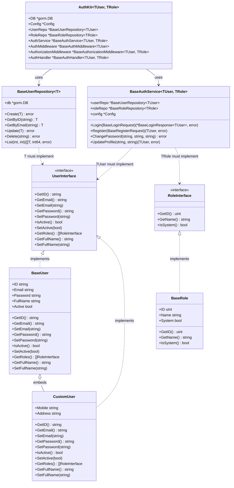
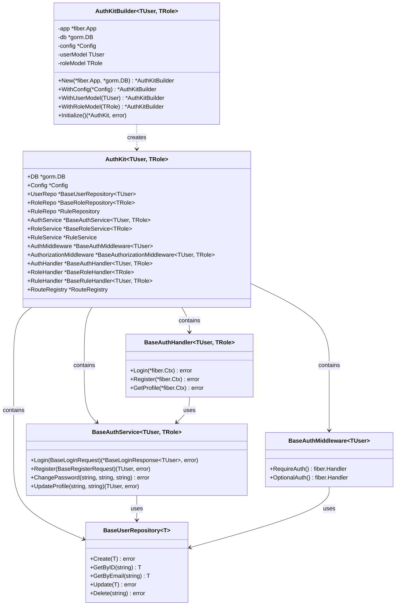
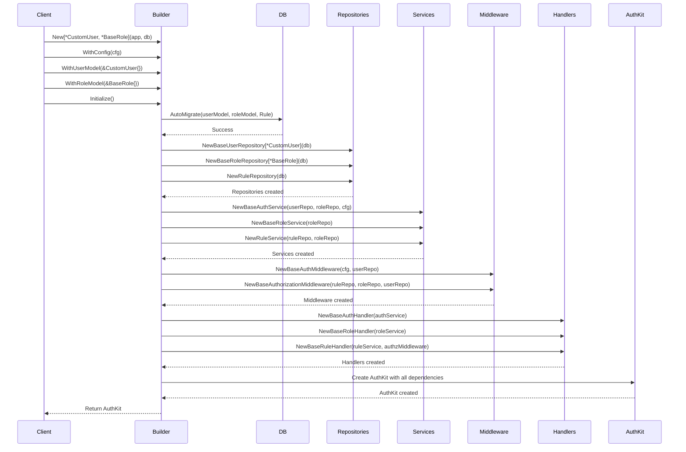
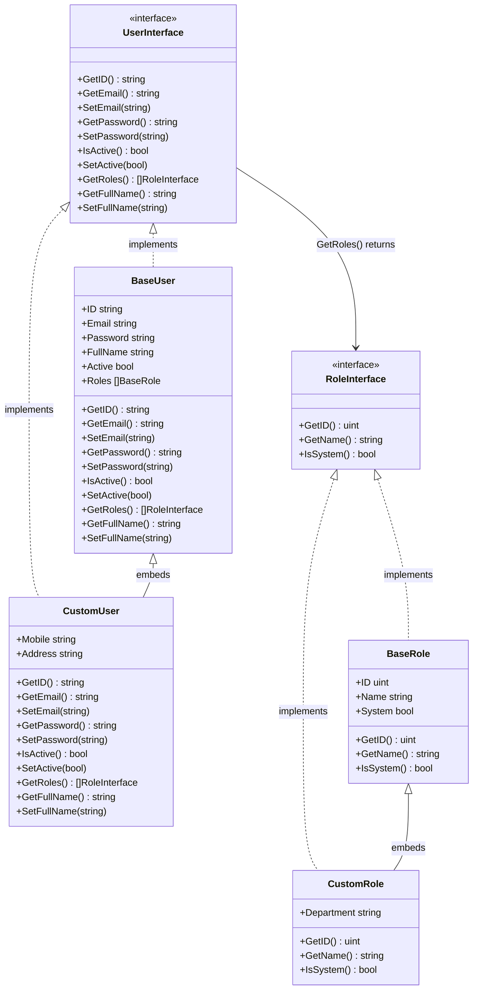
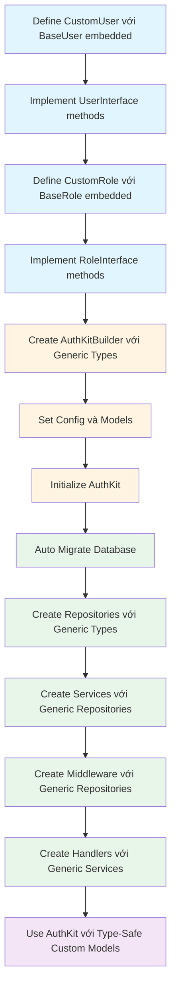

# 6. Generic Types và Extensibility

Tài liệu này mô tả cách AuthKit sử dụng Generic Types trong Go để hỗ trợ mở rộng với custom User và Role models.

---

## 6.0. Tại sao cần Generic Types và Extensibility?

### Vấn đề thực tế

Trong thực tế, mỗi ứng dụng có yêu cầu khác nhau về User model:

- **Ứng dụng A**: Cần User với các trường cơ bản (email, password, full_name)
- **Ứng dụng B**: Cần User thêm trường `mobile` và `address`
- **Ứng dụng C**: Cần User thêm trường `company_id`, `department`, `avatar_url`
- **Ứng dụng D**: Cần User với các trường hoàn toàn khác biệt

### Cách làm không dùng Generic Types (vấn đề)

**Cách 1: Hard-code BaseUser**
```go
// Vấn đề: Chỉ hỗ trợ BaseUser, không thể mở rộng
type AuthService struct {
    userRepo *UserRepository  // Chỉ làm việc với BaseUser
}

func (s *AuthService) Login(email, password string) (*BaseUser, error) {
    user := &BaseUser{}  // Bắt buộc phải dùng BaseUser
    // ...
    return user, nil
}
```

**Vấn đề của cách này:**
- ❌ Không thể sử dụng CustomUser với các trường bổ sung
- ❌ Phải ép kiểu (type assertion) mỗi khi sử dụng: `customUser := user.(*CustomUser)`
- ❌ Mất type safety - có thể gây panic nếu ép kiểu sai
- ❌ Code không linh hoạt, khó mở rộng

**Cách 2: Dùng interface{} (empty interface)**
```go
// Vấn đề: Mất type safety hoàn toàn
type AuthService struct {
    userRepo *UserRepository
}

func (s *AuthService) Login(email, password string) (interface{}, error) {
    user := &BaseUser{}  // Trả về interface{}
    // ...
    return user, nil
}

// Sử dụng: Phải ép kiểu mỗi lần
user, _ := authService.Login(email, password)
customUser := user.(*CustomUser)  // Có thể panic nếu sai kiểu!
```

**Vấn đề của cách này:**
- ❌ Mất type safety hoàn toàn
- ❌ Phải ép kiểu mỗi lần sử dụng
- ❌ Compiler không thể phát hiện lỗi kiểu tại compile time
- ❌ Dễ gây panic tại runtime

### Giải pháp: Generic Types

Generic Types cho phép viết code **type-safe** và **linh hoạt**:

```go
// ✅ Giải pháp: Generic Types
type BaseAuthService[TUser UserInterface, TRole RoleInterface] struct {
    userRepo *BaseUserRepository[TUser]
    roleRepo *BaseRoleRepository[TRole]
}

func (s *BaseAuthService[TUser, TRole]) Login(email, password string) (*LoginResponse[TUser], error) {
    user, err := s.userRepo.GetByEmail(email)  // Trả về TUser, không phải interface{}
    // ...
    return &LoginResponse[TUser]{
        Token: token,
        User:  user,  // Type-safe, không cần ép kiểu
    }, nil
}

// Sử dụng với CustomUser
authKit := authkit.New[*CustomUser, *authkit.BaseRole](app, db)
response, _ := authKit.AuthService.Login(req)
customUser := response.User  // Đã là *CustomUser, không cần ép kiểu!
```

**Lợi ích:**
- ✅ **Type safety**: Compiler kiểm tra kiểu tại compile time
- ✅ **Không cần ép kiểu**: Trả về đúng kiểu mong muốn
- ✅ **Code reuse**: Một implementation cho nhiều kiểu User khác nhau
- ✅ **Linh hoạt**: Dễ dàng mở rộng với custom models
- ✅ **Performance**: Không có overhead của type assertions

### Ví dụ so sánh cụ thể

**Không dùng Generic (phải ép kiểu):**
```go
// Service trả về interface{}
user, _ := authService.Login(email, password)

// Phải ép kiểu mỗi lần sử dụng
customUser, ok := user.(*CustomUser)
if !ok {
    // Xử lý lỗi...
}
mobile := customUser.Mobile  // Mới truy cập được trường custom
```

**Dùng Generic (type-safe):**
```go
// Service trả về đúng kiểu *CustomUser
response, _ := authKit.AuthService.Login(req)
mobile := response.User.Mobile  // Truy cập trực tiếp, không cần ép kiểu!
```

---

## 6.1. Generic Design Pattern

### Khái niệm đơn giản

**Generic Types** giống như một "khuôn mẫu" (template) có thể tạo ra nhiều phiên bản khác nhau:

- Giống như một công thức nấu ăn có thể nấu nhiều món khác nhau
- Giống như một khuôn bánh có thể làm nhiều loại bánh khác nhau
- Generic Types cho phép viết code một lần, sử dụng với nhiều kiểu dữ liệu khác nhau

**Ví dụ đơn giản:**
```go
// Không dùng Generic: Phải viết nhiều hàm cho từng kiểu
func FindInt(slice []int, value int) int { /* ... */ }
func FindString(slice []string, value string) int { /* ... */ }
func FindFloat(slice []float64, value float64) int { /* ... */ }

// Dùng Generic: Một hàm cho tất cả kiểu
func Find[T comparable](slice []T, value T) int { /* ... */ }
```

### Generic Types trong AuthKit

AuthKit sử dụng Generic Types để hỗ trợ custom User và Role models:

```go
// AuthKit với Generic Types
type AuthKit[TUser UserInterface, TRole RoleInterface] struct {
    UserRepo *BaseUserRepository[TUser]
    RoleRepo *BaseRoleRepository[TRole]
    AuthService *BaseAuthService[TUser, TRole]
    // ...
}
```

**Giải thích:**
- `TUser`: Kiểu User (có thể là `*BaseUser`, `*CustomUser`, v.v.)
- `TRole`: Kiểu Role (có thể là `*BaseRole`, `*CustomRole`, v.v.)
- `UserInterface`: Ràng buộc - `TUser` phải implement `UserInterface`
- `RoleInterface`: Ràng buộc - `TRole` phải implement `RoleInterface`

### Class Diagram - Generic Types Architecture



### Type Constraints (Ràng buộc kiểu)

**Khái niệm:** Type Constraints đảm bảo Generic Types chỉ chấp nhận các kiểu hợp lệ.

**Ví dụ:**
```go
// TUser phải implement UserInterface
type BaseUserRepository[T UserInterface] struct {
    db *gorm.DB
}

// ✅ Hợp lệ: BaseUser implement UserInterface
repo1 := NewBaseUserRepository[*BaseUser](db)

// ✅ Hợp lệ: CustomUser implement UserInterface  
repo2 := NewBaseUserRepository[*CustomUser](db)

// ❌ Lỗi compile: string không implement UserInterface
repo3 := NewBaseUserRepository[string](db)  // Compile error!
```

**Lợi ích:**
- Compiler kiểm tra tại compile time
- Đảm bảo type safety
- Tránh lỗi runtime

### Benefits (Lợi ích)

1. **Type Safety tại Compile Time**
   - Compiler phát hiện lỗi kiểu trước khi chạy chương trình
   - Tránh panic do ép kiểu sai

2. **Không cần Type Assertions**
   - Không cần `user.(*CustomUser)` mỗi lần sử dụng
   - Code gọn gàng, dễ đọc hơn

3. **Code Reuse với Type-Specific Behavior**
   - Một implementation cho nhiều kiểu User khác nhau
   - Giảm code duplication

4. **Performance**
   - Không có overhead của type assertions
   - Compiler có thể tối ưu tốt hơn

## 6.2. Dependency Injection và Builder Pattern

### Khái niệm đơn giản

**Builder Pattern** giống như việc xây nhà:
- Bạn không thể xây nhà một lúc, mà phải làm từng bước
- Đặt nền móng → Xây tường → Lợp mái → Hoàn thiện
- Builder Pattern cho phép khởi tạo object phức tạp từng bước một cách linh hoạt

**Dependency Injection** giống như việc cung cấp công cụ:
- Thay vì tự tạo công cụ, bạn nhận công cụ từ bên ngoài
- Dễ dàng thay thế công cụ (ví dụ: dùng mock để test)
- Code linh hoạt, dễ bảo trì hơn

### AuthKitBuilder - Builder Pattern

**AuthKitBuilder** là công cụ để khởi tạo AuthKit một cách linh hoạt:

```go
// Tạo builder với generic types
builder := authkit.New[*CustomUser, *authkit.BaseRole](app, db)

// Tùy chọn: Set configuration
builder = builder.WithConfig(cfg)

// Tùy chọn: Set models cho auto migrate
builder = builder.WithUserModel(&CustomUser{})
builder = builder.WithRoleModel(&authkit.BaseRole{})

// Khởi tạo AuthKit với tất cả dependencies
authKit, err := builder.Initialize()
```

**Các methods của Builder:**

| Method | Mô tả | Ví dụ |
|--------|-------|-------|
| `New[TUser, TRole](app, db)` | Tạo builder với generic types | `New[*CustomUser, *BaseRole](app, db)` |
| `WithConfig(cfg)` | Set configuration | `builder.WithConfig(cfg)` |
| `WithUserModel(userModel)` | Set user model (cho auto migrate) | `builder.WithUserModel(&CustomUser{})` |
| `WithRoleModel(roleModel)` | Set role model (cho auto migrate) | `builder.WithRoleModel(&BaseRole{})` |
| `Initialize()` | Khởi tạo tất cả dependencies | `authKit, err := builder.Initialize()` |

### Class Diagram - Builder Pattern



### Dependency Injection Flow (Luồng khởi tạo)

Quá trình khởi tạo AuthKit diễn ra theo thứ tự sau:



**Chi tiết từng bước:**

1. **Auto Migrate với Custom Models**
   ```go
   db.AutoMigrate(&CustomUser{}, &BaseRole{}, &Rule{})
   ```
   - Tạo/update database schema
   - Hỗ trợ custom fields từ CustomUser

2. **Initialize Repositories (với Generic Types)**
   ```go
   userRepo := NewBaseUserRepository[*CustomUser](db)
   roleRepo := NewBaseRoleRepository[*BaseRole](db)
   ```
   - Repositories được khởi tạo với đúng generic type
   - Type-safe, không cần ép kiểu

3. **Initialize Services (với Generic Repositories)**
   ```go
   authService := NewBaseAuthService(userRepo, roleRepo, cfg)
   ```
   - Services nhận repositories đã được type-safe
   - Tự động làm việc với đúng kiểu User/Role

4. **Initialize Middleware (với Generic Repositories)**
   ```go
   authMiddleware := NewBaseAuthMiddleware(cfg, userRepo)
   ```
   - Middleware có thể lấy đúng kiểu User từ context

5. **Initialize Handlers (với Generic Services)**
   ```go
   authHandler := NewBaseAuthHandler(authService)
   ```
   - Handlers làm việc với services đã được type-safe

6. **Create RouteRegistry**
   ```go
   routeRegistry := NewRouteRegistry()
   ```
   - Quản lý routes và permissions

### Benefits (Lợi ích)

1. **Flexible Initialization (Khởi tạo linh hoạt)**
   - Có thể tùy chỉnh từng bước khởi tạo
   - Dễ dàng thêm/bớt dependencies

2. **Easy Testing (Dễ test)**
   - Có thể mock dependencies để test
   - Không phụ thuộc vào database thật khi test

3. **Clear Dependency Graph (Đồ thị phụ thuộc rõ ràng)**
   - Dễ hiểu mối quan hệ giữa các components
   - Dễ debug khi có lỗi

## 6.3. UserInterface và RoleInterface

### Khái niệm đơn giản

**Interface** giống như một "hợp đồng":
- Định nghĩa các methods mà một type phải có
- Không quan tâm type đó là gì, miễn là có đủ methods
- Giống như việc tuyển dụng: bạn cần người biết lái xe, không quan tâm họ là ai

**Ví dụ đơn giản:**
```go
// Interface định nghĩa "hợp đồng"
type Driver interface {
    Drive() string
}

// Bất kỳ type nào có method Drive() đều implement Driver
type Person struct {}
func (p Person) Drive() string { return "Driving..." }

type Robot struct {}
func (r Robot) Drive() string { return "Auto-driving..." }

// Cả Person và Robot đều có thể được sử dụng như Driver
```

### UserInterface

**UserInterface** định nghĩa "hợp đồng" cho User models:

```go
type UserInterface interface {
    // Identity
    GetID() string
    GetEmail() string
    SetEmail(email string)
    
    // Authentication
    GetPassword() string
    SetPassword(password string)
    
    // Status
    IsActive() bool
    SetActive(active bool)
    
    // Relationships
    GetRoles() []RoleInterface
    
    // Profile
    GetFullName() string
    SetFullName(fullName string)
}
```

**Giải thích các methods:**

| Method | Mô tả | Ví dụ |
|--------|-------|-------|
| `GetID() string` | Lấy ID của user | `user.GetID()` → `"abc123"` |
| `GetEmail() string` | Lấy email của user | `user.GetEmail()` → `"user@example.com"` |
| `SetEmail(email string)` | Set email cho user | `user.SetEmail("new@example.com")` |
| `GetPassword() string` | Lấy password đã hash | `user.GetPassword()` → `"$2a$10$..."` |
| `SetPassword(password string)` | Set password đã hash | `user.SetPassword(hashed)` |
| `IsActive() bool` | Kiểm tra user có active không | `user.IsActive()` → `true` |
| `SetActive(active bool)` | Set trạng thái active | `user.SetActive(false)` |
| `GetRoles() []RoleInterface` | Lấy danh sách roles | `user.GetRoles()` → `[admin, user]` |
| `GetFullName() string` | Lấy tên đầy đủ | `user.GetFullName()` → `"John Doe"` |
| `SetFullName(fullName string)` | Set tên đầy đủ | `user.SetFullName("Jane Doe")` |

### RoleInterface

**RoleInterface** định nghĩa "hợp đồng" cho Role models:

```go
type RoleInterface interface {
    GetID() uint
    GetName() string
    IsSystem() bool
}
```

**Giải thích các methods:**

| Method | Mô tả | Ví dụ |
|--------|-------|-------|
| `GetID() uint` | Lấy ID của role | `role.GetID()` → `1` |
| `GetName() string` | Lấy tên của role | `role.GetName()` → `"admin"` |
| `IsSystem() bool` | Kiểm tra có phải system role không | `role.IsSystem()` → `false` |

### Class Diagram - Interface Implementation



### Implementation: BaseUser và BaseRole

**BaseUser** và **BaseRole** đã implement đầy đủ các interfaces:

```go
// BaseUser implement UserInterface
type BaseUser struct {
    ID       string
    Email    string
    Password string
    FullName string
    Active   bool
    Roles    []BaseRole
}

// Tất cả methods của UserInterface đã được implement
func (u *BaseUser) GetID() string { return u.ID }
func (u *BaseUser) GetEmail() string { return u.Email }
// ... các methods khác
```

**Lợi ích:**
- ✅ BaseUser và BaseRole có thể sử dụng ngay
- ✅ Custom models chỉ cần embed BaseUser/BaseRole và delegate methods
- ✅ Đảm bảo tất cả models đều có đủ methods cần thiết

### Tại sao cần Interface?

1. **Polymorphism (Đa hình)**
   - Có thể sử dụng nhiều kiểu User khác nhau thông qua cùng một interface
   - Code linh hoạt, dễ mở rộng

2. **Type Safety**
   - Compiler đảm bảo custom models có đủ methods
   - Tránh lỗi thiếu methods tại runtime

3. **Abstraction (Trừu tượng hóa)**
   - Ẩn chi tiết implementation
   - Chỉ quan tâm đến behavior, không quan tâm đến cấu trúc

4. **Testing**
   - Dễ dàng tạo mock objects implement interface
   - Test không phụ thuộc vào implementation cụ thể

## 6.4. Custom User Model

### Khái niệm đơn giản

**Custom User Model** giống như việc mở rộng một căn nhà:
- Bạn có căn nhà cơ bản (BaseUser) với đầy đủ tiện nghi
- Bạn muốn thêm phòng mới (custom fields) như phòng gym, hồ bơi
- Bạn không phải xây lại từ đầu, chỉ cần mở rộng thêm

**Embedding** trong Go giống như việc kế thừa:
- CustomUser "kế thừa" tất cả fields và methods từ BaseUser
- Có thể thêm fields mới (Mobile, Address)
- Có thể override methods nếu cần

### Cách tạo Custom User Model

**Bước 1: Định nghĩa struct với embedded BaseUser**

```go
type CustomUser struct {
    authkit.BaseUser `gorm:"embedded"`  // Embed BaseUser
    Mobile  string `gorm:"type:varchar(15)" json:"mobile"`
    Address string `gorm:"type:varchar(200)" json:"address"`
}
```

**Giải thích:**
- `authkit.BaseUser \`gorm:"embedded"\``: Embed BaseUser vào CustomUser
  - Tất cả fields của BaseUser (ID, Email, Password, v.v.) sẽ có trong CustomUser
  - Tag `gorm:"embedded"` báo cho GORM biết đây là embedded struct
- `Mobile` và `Address`: Các trường custom bổ sung

**Bước 2: Implement UserInterface (delegate về BaseUser)**

```go
// Delegate tất cả methods về BaseUser
func (u *CustomUser) GetID() string {
    return u.BaseUser.GetID()
}

func (u *CustomUser) GetEmail() string {
    return u.BaseUser.GetEmail()
}

func (u *CustomUser) SetEmail(email string) {
    u.BaseUser.SetEmail(email)
}

// ... các methods khác tương tự
```

**Giải thích:**
- Mỗi method gọi method tương ứng của BaseUser
- Đảm bảo CustomUser implement đầy đủ UserInterface
- Có thể override methods nếu cần behavior khác

**Bước 3: Chỉ định tên bảng (tùy chọn)**

```go
func (CustomUser) TableName() string {
    return "users"  // Sử dụng cùng bảng với BaseUser
}
```

### Class Diagram - Custom User Model

```mermaid
classDiagram
    class UserInterface {
        <<interface>>
        +GetID() string
        +GetEmail() string
        +SetEmail(string)
        +GetPassword() string
        +SetPassword(string)
        +IsActive() bool
        +SetActive(bool)
        +GetRoles() []RoleInterface
        +GetFullName() string
        +SetFullName(string)
    }
    
    class BaseUser {
        +ID string
        +Email string
        +Password string
        +FullName string
        +Active bool
        +Roles []BaseRole
        +GetID() string
        +GetEmail() string
        +SetEmail(string)
        +GetPassword() string
        +SetPassword(string)
        +IsActive() bool
        +SetActive(bool)
        +GetRoles() []RoleInterface
        +GetFullName() string
        +SetFullName(string)
    }
    
    class CustomUser {
        +Mobile string
        +Address string
        +GetID() string
        +GetEmail() string
        +SetEmail(string)
        +GetPassword() string
        +SetPassword(string)
        +IsActive() bool
        +SetActive(bool)
        +GetRoles() []RoleInterface
        +GetFullName() string
        +SetFullName(string)
    }
    
    UserInterface <|.. BaseUser : implements
    UserInterface <|.. CustomUser : implements
    BaseUser <|-- CustomUser : embeds (gorm:"embedded")
    
    note for CustomUser : CustomUser có tất cả fields\ncủa BaseUser + Mobile + Address
```

### Ví dụ đầy đủ

```go
package main

import (
    "github.com/techmaster-vietnam/authkit"
    "github.com/techmaster-vietnam/authkit/core"
)

// CustomUser với các trường bổ sung
type CustomUser struct {
    authkit.BaseUser `gorm:"embedded"`
    Mobile  string `gorm:"type:varchar(15)" json:"mobile"`
    Address string `gorm:"type:varchar(200)" json:"address"`
}

// Implement UserInterface bằng cách delegate về BaseUser
func (u *CustomUser) GetID() string {
    return u.BaseUser.GetID()
}

func (u *CustomUser) GetEmail() string {
    return u.BaseUser.GetEmail()
}

func (u *CustomUser) SetEmail(email string) {
    u.BaseUser.SetEmail(email)
}

func (u *CustomUser) GetPassword() string {
    return u.BaseUser.GetPassword()
}

func (u *CustomUser) SetPassword(password string) {
    u.BaseUser.SetPassword(password)
}

func (u *CustomUser) IsActive() bool {
    return u.BaseUser.IsActive()
}

func (u *CustomUser) SetActive(active bool) {
    u.BaseUser.SetActive(active)
}

func (u *CustomUser) GetRoles() []core.RoleInterface {
    return u.BaseUser.GetRoles()
}

func (u *CustomUser) GetFullName() string {
    return u.BaseUser.GetFullName()
}

func (u *CustomUser) SetFullName(fullName string) {
    u.BaseUser.SetFullName(fullName)
}

// Sử dụng cùng bảng users
func (CustomUser) TableName() string {
    return "users"
}
```

### Requirements (Yêu cầu)

1. **Phải implement tất cả methods của UserInterface**
   - Có thể delegate về BaseUser (như ví dụ trên)
   - Hoặc override nếu cần behavior khác

2. **Sử dụng cùng bảng `users` (hoặc chỉ định bảng khác)**
   ```go
   func (CustomUser) TableName() string {
       return "users"  // Hoặc "custom_users" nếu muốn bảng riêng
   }
   ```

3. **Auto migrate sẽ tạo các trường custom**
   - Khi khởi tạo AuthKit với CustomUser, GORM sẽ tự động tạo các cột `mobile` và `address`

### Sử dụng Custom User Model

**Khởi tạo AuthKit với CustomUser:**

```go
// Tạo AuthKit với CustomUser
authKit, err := authkit.New[*CustomUser, *authkit.BaseRole](app, db).
    WithUserModel(&CustomUser{}).
    WithRoleModel(&authkit.BaseRole{}).
    Initialize()
```

**Lấy CustomUser từ context:**

```go
// Trong handler hoặc middleware
func GetProfile(c *fiber.Ctx) error {
    // Lấy CustomUser từ context (type-safe)
    user, ok := authkit.GetUserFromContextGeneric[*CustomUser](c)
    if !ok {
        return c.Status(401).JSON(fiber.Map{"error": "Unauthorized"})
    }
    
    // Truy cập trực tiếp custom fields
    mobile := user.Mobile   // ✅ Type-safe, không cần ép kiểu!
    address := user.Address
    
    return c.JSON(fiber.Map{
        "id":      user.GetID(),
        "email":   user.GetEmail(),
        "mobile":  mobile,
        "address": address,
    })
}
```

**Lợi ích:**
- ✅ Type-safe: Truy cập trực tiếp custom fields
- ✅ Không cần ép kiểu: `user.Mobile` thay vì `user.(*CustomUser).Mobile`
- ✅ Compiler kiểm tra: Phát hiện lỗi tại compile time
- ✅ Code gọn gàng: Dễ đọc, dễ maintain

### So sánh: Không dùng Generic vs Dùng Generic

**Không dùng Generic (phải ép kiểu):**
```go
// Service trả về interface{}
user, _ := authService.Login(email, password)

// Phải ép kiểu mỗi lần
customUser, ok := user.(*CustomUser)
if !ok {
    // Xử lý lỗi...
}
mobile := customUser.Mobile  // Mới truy cập được
```

**Dùng Generic (type-safe):**
```go
// Service trả về đúng kiểu *CustomUser
response, _ := authKit.AuthService.Login(req)
mobile := response.User.Mobile  // Truy cập trực tiếp!
```

## 6.5. Custom Role Model

### Khái niệm đơn giản

**Custom Role Model** tương tự Custom User Model:
- Mở rộng BaseRole với các trường bổ sung
- Ví dụ: Thêm trường `Department` để phân loại roles theo phòng ban
- Hoặc thêm `Level` để phân cấp roles

### Cách tạo Custom Role Model

**Bước 1: Định nghĩa struct với embedded BaseRole**

```go
type CustomRole struct {
    authkit.BaseRole `gorm:"embedded"`  // Embed BaseRole
    Department string `gorm:"type:varchar(100)" json:"department"`
    Level      int    `gorm:"default:1" json:"level"`  // Ví dụ thêm Level
}
```

**Bước 2: Implement RoleInterface (delegate về BaseRole)**

```go
func (r *CustomRole) GetID() uint {
    return r.BaseRole.GetID()
}

func (r *CustomRole) GetName() string {
    return r.BaseRole.GetName()
}

func (r *CustomRole) IsSystem() bool {
    return r.BaseRole.IsSystem()
}
```

**Bước 3: Chỉ định tên bảng (tùy chọn)**

```go
func (CustomRole) TableName() string {
    return "roles"  // Sử dụng cùng bảng với BaseRole
}
```

### Class Diagram - Custom Role Model

```mermaid
classDiagram
    class RoleInterface {
        <<interface>>
        +GetID() uint
        +GetName() string
        +IsSystem() bool
    }
    
    class BaseRole {
        +ID uint
        +Name string
        +System bool
        +Users []BaseUser
        +GetID() uint
        +GetName() string
        +IsSystem() bool
    }
    
    class CustomRole {
        +Department string
        +Level int
        +GetID() uint
        +GetName() string
        +IsSystem() bool
    }
    
    RoleInterface <|.. BaseRole : implements
    RoleInterface <|.. CustomRole : implements
    BaseRole <|-- CustomRole : embeds (gorm:"embedded")
    
    note for CustomRole : CustomRole có tất cả fields\ncủa BaseRole + Department + Level
```

### Ví dụ đầy đủ

```go
package main

import (
    "github.com/techmaster-vietnam/authkit"
    "github.com/techmaster-vietnam/authkit/core"
)

// CustomRole với các trường bổ sung
type CustomRole struct {
    authkit.BaseRole `gorm:"embedded"`
    Department string `gorm:"type:varchar(100)" json:"department"`
    Level      int    `gorm:"default:1" json:"level"`
}

// Implement RoleInterface bằng cách delegate về BaseRole
func (r *CustomRole) GetID() uint {
    return r.BaseRole.GetID()
}

func (r *CustomRole) GetName() string {
    return r.BaseRole.GetName()
}

func (r *CustomRole) IsSystem() bool {
    return r.BaseRole.IsSystem()
}

// Sử dụng cùng bảng roles
func (CustomRole) TableName() string {
    return "roles"
}
```

### Requirements (Yêu cầu)

1. **Phải implement tất cả methods của RoleInterface**
   - `GetID() uint`
   - `GetName() string`
   - `IsSystem() bool`

2. **Sử dụng cùng bảng `roles` (hoặc chỉ định bảng khác)**
   ```go
   func (CustomRole) TableName() string {
       return "roles"  // Hoặc "custom_roles" nếu muốn bảng riêng
   }
   ```

### Sử dụng Custom Role Model

**Khởi tạo AuthKit với CustomRole:**

```go
// Tạo AuthKit với CustomRole
authKit, err := authkit.New[*authkit.BaseUser, *CustomRole](app, db).
    WithUserModel(&authkit.BaseUser{}).
    WithRoleModel(&CustomRole{}).
    Initialize()
```

**Hoặc kết hợp cả CustomUser và CustomRole:**

```go
// Tạo AuthKit với cả CustomUser và CustomRole
authKit, err := authkit.New[*CustomUser, *CustomRole](app, db).
    WithUserModel(&CustomUser{}).
    WithRoleModel(&CustomRole{}).
    Initialize()
```

**Sử dụng trong code:**

```go
// Lấy roles từ user
user, _ := authKit.UserRepo.GetByID(userID)
roles := user.GetRoles()

// Roles đã là []RoleInterface, nhưng khi lấy từ DB sẽ là CustomRole
for _, roleInterface := range roles {
    // Nếu cần truy cập custom fields, có thể ép kiểu
    if customRole, ok := roleInterface.(*CustomRole); ok {
        department := customRole.Department
        level := customRole.Level
        // ...
    }
}
```

### Tổng hợp: Sử dụng cả CustomUser và CustomRole

```go
package main

import (
    "github.com/gofiber/fiber/v2"
    "github.com/techmaster-vietnam/authkit"
    "gorm.io/gorm"
)

// CustomUser với Mobile và Address
type CustomUser struct {
    authkit.BaseUser `gorm:"embedded"`
    Mobile  string `gorm:"type:varchar(15)" json:"mobile"`
    Address string `gorm:"type:varchar(200)" json:"address"`
}

// Implement UserInterface (delegate về BaseUser)
// ... (các methods như đã trình bày ở phần 6.4)

// CustomRole với Department và Level
type CustomRole struct {
    authkit.BaseRole `gorm:"embedded"`
    Department string `gorm:"type:varchar(100)" json:"department"`
    Level      int    `gorm:"default:1" json:"level"`
}

// Implement RoleInterface (delegate về BaseRole)
// ... (các methods như đã trình bày ở trên)

func main() {
    app := fiber.New()
    db := setupDatabase()  // Your database setup
    
    // Khởi tạo AuthKit với cả CustomUser và CustomRole
    authKit, err := authkit.New[*CustomUser, *CustomRole](app, db).
        WithUserModel(&CustomUser{}).
        WithRoleModel(&CustomRole{}).
        Initialize()
    
    if err != nil {
        panic(err)
    }
    
    // Sử dụng authKit với type-safe CustomUser và CustomRole
    // ...
}
```

### Lợi ích của Custom Role Model

1. **Mở rộng linh hoạt**
   - Thêm các trường phù hợp với business logic
   - Ví dụ: Department, Level, Permissions, v.v.

2. **Type Safety**
   - Compiler đảm bảo đúng kiểu Role
   - Tránh lỗi runtime

3. **Code Reuse**
   - Tái sử dụng logic từ BaseRole
   - Chỉ cần thêm custom fields và methods

---

## 6.6. Tổng kết và Best Practices

### Tổng kết

Generic Types và Extensibility trong AuthKit cho phép:

1. **Type-Safe Custom Models**
   - Sử dụng CustomUser và CustomRole với type safety
   - Không cần ép kiểu, compiler kiểm tra tại compile time

2. **Code Reuse**
   - Một implementation cho nhiều kiểu User/Role khác nhau
   - Giảm code duplication

3. **Linh hoạt và Mở rộng**
   - Dễ dàng thêm custom fields
   - Không cần modify code của AuthKit

4. **Dependency Injection**
   - Builder Pattern giúp khởi tạo linh hoạt
   - Dễ test với mock dependencies

### Best Practices

1. **Luôn implement đầy đủ Interface**
   ```go
   // ✅ Đúng: Implement đầy đủ
   func (u *CustomUser) GetID() string { return u.BaseUser.GetID() }
   func (u *CustomUser) GetEmail() string { return u.BaseUser.GetEmail() }
   // ... tất cả methods
   
   // ❌ Sai: Thiếu methods
   func (u *CustomUser) GetID() string { return u.BaseUser.GetID() }
   // Thiếu GetEmail() → Compile error!
   ```

2. **Sử dụng Delegate Pattern**
   ```go
   // ✅ Đúng: Delegate về BaseUser
   func (u *CustomUser) GetID() string {
       return u.BaseUser.GetID()
   }
   
   // ❌ Tránh: Duplicate logic
   func (u *CustomUser) GetID() string {
       return u.ID  // Nếu BaseUser.ID thay đổi, code này sẽ sai
   }
   ```

3. **Đặt tên bảng rõ ràng**
   ```go
   // ✅ Đúng: Chỉ định rõ ràng
   func (CustomUser) TableName() string {
       return "users"
   }
   
   // ❌ Tránh: Để GORM tự suy luận (có thể sai)
   ```

4. **Sử dụng Generic Helper Functions**
   ```go
   // ✅ Đúng: Sử dụng generic helper
   user, ok := authkit.GetUserFromContextGeneric[*CustomUser](c)
   
   // ❌ Tránh: Ép kiểu thủ công
   userInterface, _ := middleware.GetUserFromContext(c)
   user := userInterface.(*CustomUser)  // Có thể panic!
   ```

5. **Document Custom Fields**
   ```go
   type CustomUser struct {
       authkit.BaseUser `gorm:"embedded"`
       // Mobile: Số điện thoại của user (tối đa 15 ký tự)
       Mobile  string `gorm:"type:varchar(15)" json:"mobile"`
       // Address: Địa chỉ của user (tối đa 200 ký tự)
       Address string `gorm:"type:varchar(200)" json:"address"`
   }
   ```

### Flow Diagram - Tổng quan Generic Types Flow



---

**Xem thêm:**
- [2. Kiến trúc tổng thể](./02-kien-truc-tong-the.md)
- [5. Database Schema và Models](./05-database-schema-models.md)
- [8. Tích hợp và Sử dụng](./08-tich-hop-su-dung.md)
- [Mục lục](./README.md)

