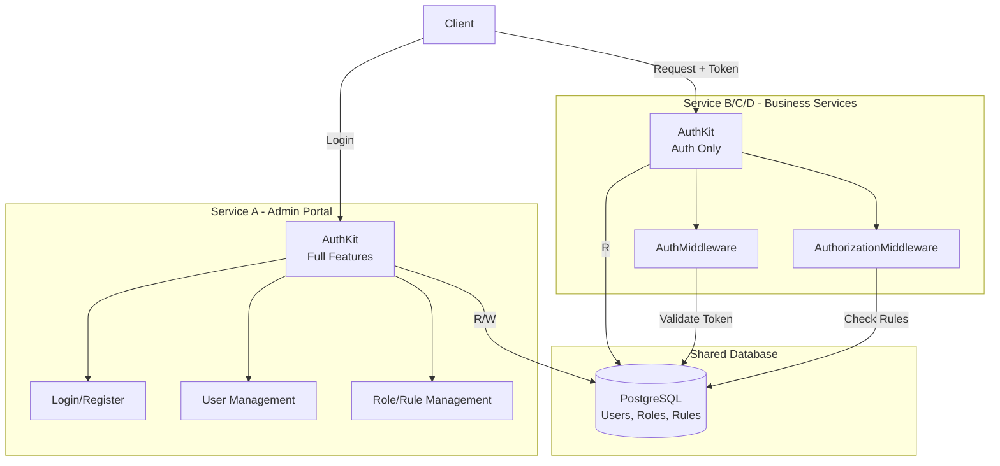
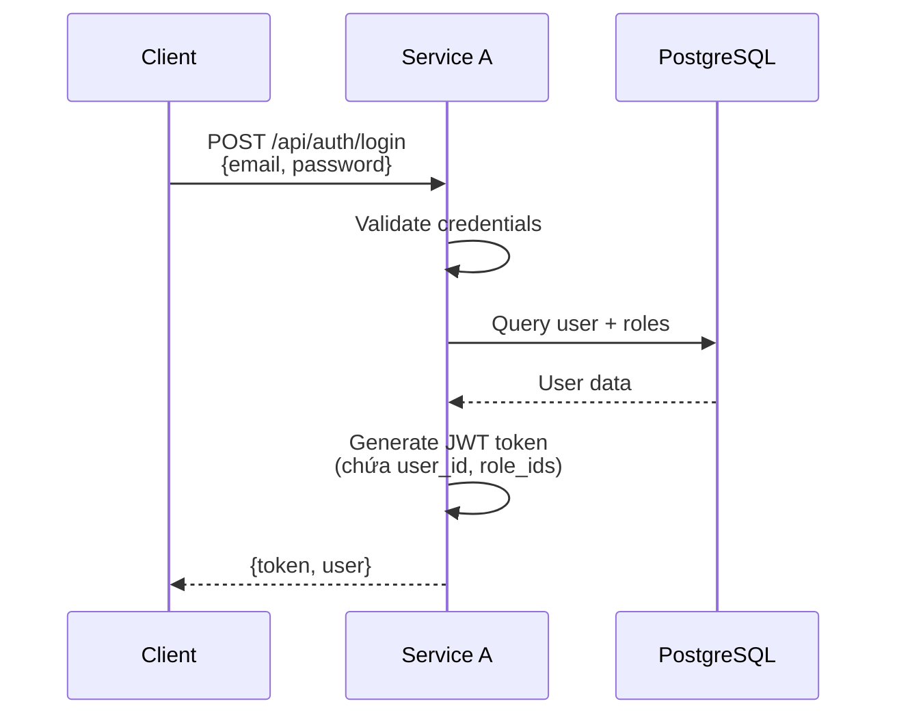
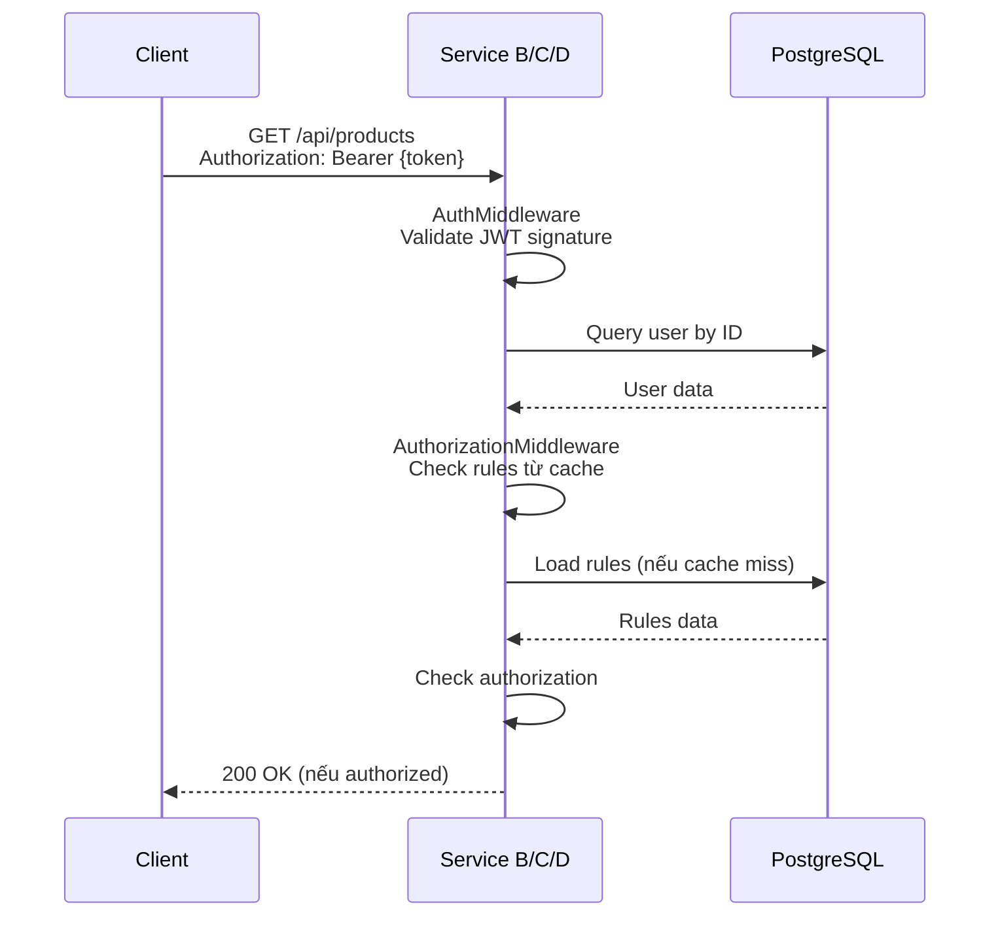
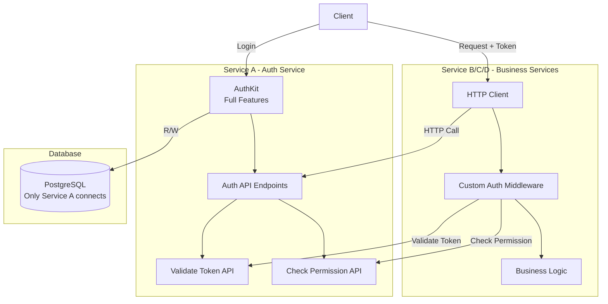
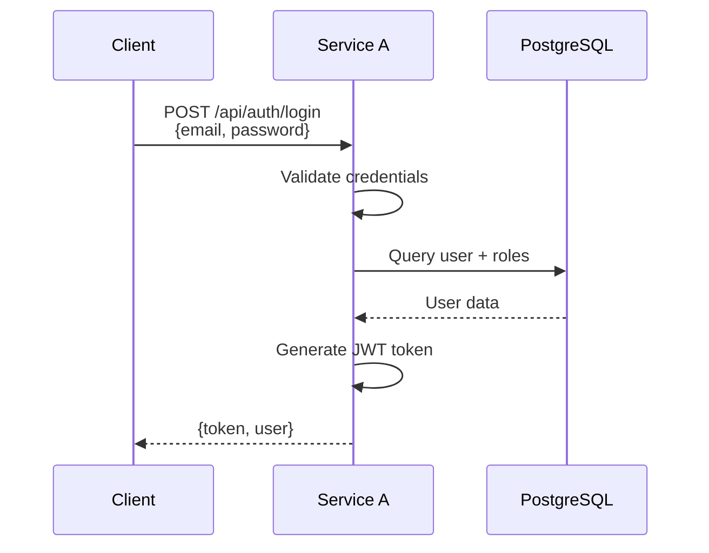
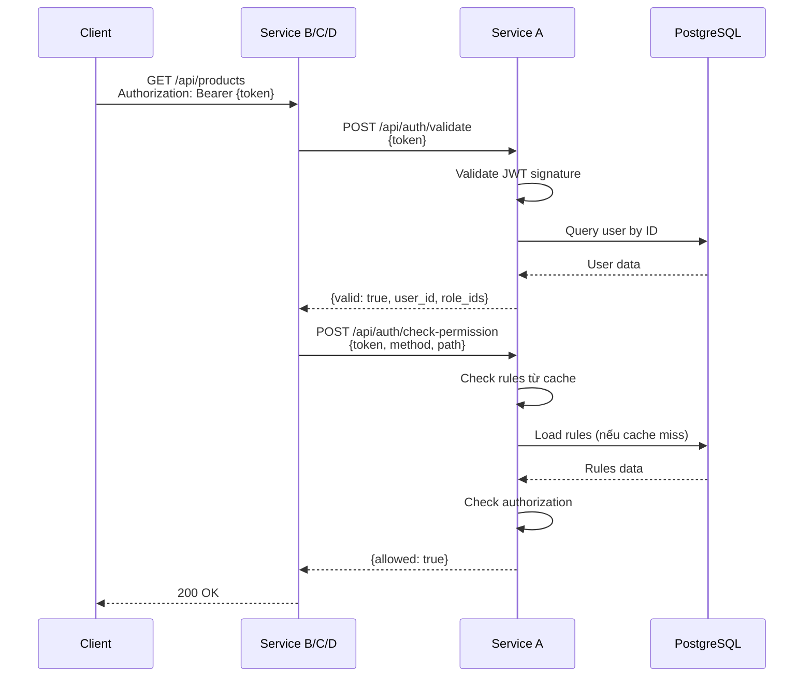

# 10. Kiến trúc Microservice với AuthKit

Tài liệu này so sánh chi tiết hai phương án triển khai authentication và authorization trong kiến trúc microservice sử dụng AuthKit.

> 📖 **Trước khi đọc**: Nếu chưa biết AuthKit là gì, hãy xem [1. Tổng quan về AuthKit](./01-tong-quan.md) trước.  
> 🔍 **Chi tiết**: Để hiểu về middleware và security, xem [3. Middleware và Security](./03-middleware-security.md).

---

## 10.1. Tổng quan

### 10.1.1. Bài toán

Giả sử bạn có một hệ thống microservice với nhiều ứng dụng Golang REST API:

- **Service A**: Ứng dụng quản trị với giao diện để quản lý users, roles, rules
- **Service B, C, D**: Các service business cần authorization khi user đã login thành công ở Service A

**Yêu cầu:**
- User login thành công ở Service A, có token
- User có thể truy cập Service B, C, D mà không cần login lại (Single Sign-On)
- Tất cả services đều kết nối vào PostgreSQL để lưu thông tin user, role, rule
- Cần cơ chế lưu token và thông tin user để đảm bảo SSO

### 10.1.2. Hai phương án

#### Phương án 1: Direct DB Connection
```
┌─────────┐     ┌─────────┐     ┌─────────┐
│   A     │     │   B     │     │   C     │
│ (Admin) │     │(Service)│     │(Service)│
└────┬────┘     └────┬────┘     └────┬────┘
     │               │               │
     └───────────────┴───────────────┘
                     │
              ┌──────▼──────┐
              │  PostgreSQL │
              │  (Shared)   │
              └─────────────┘
```

**Đặc điểm:**
- Service B, C, D dùng AuthKit, kết nối trực tiếp vào PostgreSQL
- Mỗi service có connection pool riêng
- Tất cả services dùng chung JWT_SECRET
- Token được validate và user được load từ DB ở mỗi service

#### Phương án 2: Auth Service API
```
┌─────────┐     ┌─────────┐     ┌─────────┐
│   A     │     │   B     │     │   C     │
│ (Auth)  │◄────│(Service)│     │(Service)│
└────┬────┘     └─────────┘     └─────────┘
     │
     ▼
┌─────────────┐
│  PostgreSQL │
└─────────────┘
```

**Đặc điểm:**
- Service A là Auth Service tập trung, cung cấp API để validate token và check authorization
- Service B, C, D gọi HTTP API của Service A để validate token
- Chỉ Service A kết nối trực tiếp vào PostgreSQL
- Service B, C, D không cần database connection

---

## 10.2. Phương án 1: Direct DB Connection

### 10.2.1. Kiến trúc chi tiết



### 10.2.2. Luồng xử lý

#### Luồng Login (Service A)


#### Luồng Request đến Service B/C/D


### 10.2.3. Implementation

#### Service A (Admin Portal)
```go
// Service A - main.go
package main

import (
    "github.com/gofiber/fiber/v2"
    "github.com/techmaster-vietnam/authkit"
    "github.com/techmaster-vietnam/authkit/router"
    "gorm.io/driver/postgres"
    "gorm.io/gorm"
)

func main() {
    // 1. Load config
    cfg := authkit.LoadConfig() // JWT_SECRET từ env
    
    // 2. Connect database
    db, _ := gorm.Open(postgres.Open(dsn), &gorm.Config{})
    
    // 3. Create Fiber app
    app := fiber.New()
    
    // 4. Initialize AuthKit với full features
    ak, _ := authkit.New[*authkit.BaseUser, *authkit.BaseRole](app, db).
        WithConfig(cfg).
        WithUserModel(&authkit.BaseUser{}).
        WithRoleModel(&authkit.BaseRole{}).
        Initialize()
    
    // 5. Setup routes với auth endpoints
    apiRouter := router.NewAuthRouter(app, ak.RouteRegistry, 
        ak.AuthMiddleware, ak.AuthorizationMiddleware).Group("/api")
    
    // Auth routes
    auth := apiRouter.Group("/auth")
    auth.Post("/login", ak.AuthHandler.Login).Public().Register()
    auth.Post("/register", ak.AuthHandler.Register).Public().Register()
    
    // Admin routes
    users := apiRouter.Group("/users")
    users.Get("/", adminHandler.ListUsers).
        Allow("admin").
        Register()
    
    // 6. Sync routes
    ak.SyncRoutes()
    ak.InvalidateCache()
    
    app.Listen(":3000")
}
```

#### Service B/C/D (Business Services)
```go
// Service B/C/D - main.go
package main

import (
    "github.com/gofiber/fiber/v2"
    "github.com/techmaster-vietnam/authkit"
    "github.com/techmaster-vietnam/authkit/router"
    "gorm.io/driver/postgres"
    "gorm.io/gorm"
)

func main() {
    // 1. Load config (CÙNG JWT_SECRET với Service A)
    cfg := authkit.LoadConfig()
    
    // 2. Connect database (CÙNG database với Service A)
    db, _ := gorm.Open(postgres.Open(dsn), &gorm.Config{})
    
    // 3. Create Fiber app
    app := fiber.New()
    
    // 4. Initialize AuthKit (GIỐNG HỆT Service A)
    ak, _ := authkit.New[*authkit.BaseUser, *authkit.BaseRole](app, db).
        WithConfig(cfg).
        WithUserModel(&authkit.BaseUser{}).
        WithRoleModel(&authkit.BaseRole{}).
        Initialize()
    
    // 5. Setup routes với middleware
    apiRouter := router.NewAuthRouter(app, ak.RouteRegistry, 
        ak.AuthMiddleware, ak.AuthorizationMiddleware).Group("/api")
    
    // Business routes
    products := apiRouter.Group("/products")
    products.Get("/", productHandler.List).
        Allow("reader", "admin").  // ← Sử dụng middleware có sẵn
        Register()
    products.Post("/", productHandler.Create).
        Allow("admin").
        Register()
    
    // 6. Sync routes (cần để load rules vào cache)
    ak.SyncRoutes()
    ak.InvalidateCache()
    
    app.Listen(":3001")
}
```

**Điểm quan trọng:**
- ✅ Service B/C/D chỉ cần copy code từ Service A
- ✅ Không cần viết code mới
- ✅ Sử dụng middleware có sẵn: `ak.AuthMiddleware.RequireAuth()` và `ak.AuthorizationMiddleware.Authorize()`
- ✅ Tất cả services dùng chung `JWT_SECRET` và database
- ✅ Mỗi service set `SERVICE_NAME` khác nhau trong `.env` để tách biệt rules
- ✅ Repository tự động filter rules theo `service_name` khi load cache

### 10.2.4. Configuration

#### Service A (.env)
```env
JWT_SECRET=shared-secret-key-for-all-services
JWT_EXPIRATION_HOURS=24
DB_HOST=postgres-host
DB_NAME=authkit
DB_USER=postgres
DB_PASSWORD=postgres
SERVICE_NAME=A  # Service name cho microservice isolation
```

#### Service B/C/D (.env)
```env
JWT_SECRET=shared-secret-key-for-all-services  # CÙNG với Service A
DB_HOST=postgres-host                          # CÙNG database
DB_NAME=authkit
DB_USER=postgres
DB_PASSWORD=postgres
SERVICE_NAME=B  # Service name khác nhau cho mỗi service (B, C, D)
```

---

## 10.3. Phương án 2: Auth Service API

### 10.3.1. Kiến trúc chi tiết



### 10.3.2. Luồng xử lý

#### Luồng Login (Service A)


#### Luồng Request đến Service B/C/D


### 10.3.3. Implementation

#### Service A - Thêm Auth API Endpoints

```go
// Service A - handlers/auth_api_handler.go (FILE MỚI)
package handlers

import (
    "github.com/gofiber/fiber/v2"
    "github.com/techmaster-vietnam/authkit/utils"
    "github.com/techmaster-vietnam/goerrorkit"
)

type AuthAPIHandler struct {
    config     *config.Config
    userRepo   *repository.UserRepository
    ruleRepo   *repository.RuleRepository
    roleRepo   *repository.RoleRepository
    authzMw    *middleware.AuthorizationMiddleware
}

func NewAuthAPIHandler(
    cfg *config.Config,
    userRepo *repository.UserRepository,
    ruleRepo *repository.RuleRepository,
    roleRepo *repository.RoleRepository,
    authzMw *middleware.AuthorizationMiddleware,
) *AuthAPIHandler {
    return &AuthAPIHandler{
        config:   cfg,
        userRepo: userRepo,
        ruleRepo: ruleRepo,
        roleRepo: roleRepo,
        authzMw:  authzMw,
    }
}

// ValidateToken - API endpoint để validate token
// POST /api/auth/validate
func (h *AuthAPIHandler) ValidateToken(c *fiber.Ctx) error {
    var req struct {
        Token string `json:"token"`
    }
    if err := c.BodyParser(&req); err != nil {
        return goerrorkit.NewValidationError("Token không hợp lệ", nil)
    }
    
    // Validate JWT signature
    claims, err := utils.ValidateToken(req.Token, h.config.JWT.Secret)
    if err != nil {
        return goerrorkit.NewAuthError(401, "Token không hợp lệ")
    }
    
    // Load user từ DB
    user, err := h.userRepo.GetByID(claims.UserID)
    if err != nil {
        return goerrorkit.NewAuthError(401, "User không tồn tại")
    }
    
    if !user.IsActive() {
        return goerrorkit.NewAuthError(403, "Tài khoản đã bị vô hiệu hóa")
    }
    
    return c.JSON(fiber.Map{
        "valid":    true,
        "user_id":  user.ID,
        "email":    user.Email,
        "role_ids": claims.RoleIDs,
    })
}

// CheckPermission - API endpoint để check permission
// POST /api/auth/check-permission
func (h *AuthAPIHandler) CheckPermission(c *fiber.Ctx) error {
    var req struct {
        Token  string `json:"token"`
        Method string `json:"method"`
        Path   string `json:"path"`
    }
    if err := c.BodyParser(&req); err != nil {
        return goerrorkit.NewValidationError("Request không hợp lệ", nil)
    }
    
    // Validate token
    claims, err := utils.ValidateToken(req.Token, h.config.JWT.Secret)
    if err != nil {
        return goerrorkit.NewAuthError(401, "Token không hợp lệ")
    }
    
    // Load user
    user, err := h.userRepo.GetByID(claims.UserID)
    if err != nil {
        return goerrorkit.NewAuthError(401, "User không tồn tại")
    }
    
    // Find matching rules
    matchingRules := h.authzMw.FindMatchingRules(req.Method, req.Path)
    
    // Check authorization logic (giống AuthorizationMiddleware)
    // ... (phức tạp, cần implement lại logic)
    
    return c.JSON(fiber.Map{
        "allowed": true,
    })
}
```

#### Service B/C/D - HTTP Client và Custom Middleware

```go
// Service B/C/D - client/auth_client.go (FILE MỚI)
package client

import (
    "bytes"
    "encoding/json"
    "fmt"
    "net/http"
    "time"
)

type AuthClient struct {
    baseURL    string
    httpClient *http.Client
}

func NewAuthClient(baseURL string) *AuthClient {
    return &AuthClient{
        baseURL: baseURL,
        httpClient: &http.Client{
            Timeout: 5 * time.Second,
        },
    }
}

type ValidateTokenResponse struct {
    Valid   bool     `json:"valid"`
    UserID  string   `json:"user_id"`
    Email   string   `json:"email"`
    RoleIDs []uint   `json:"role_ids"`
}

func (c *AuthClient) ValidateToken(token string) (*ValidateTokenResponse, error) {
    reqBody, _ := json.Marshal(map[string]string{"token": token})
    
    resp, err := c.httpClient.Post(
        c.baseURL+"/api/auth/validate",
        "application/json",
        bytes.NewBuffer(reqBody),
    )
    if err != nil {
        return nil, fmt.Errorf("failed to call auth API: %w", err)
    }
    defer resp.Body.Close()
    
    if resp.StatusCode != http.StatusOK {
        return nil, fmt.Errorf("auth API returned status %d", resp.StatusCode)
    }
    
    var result ValidateTokenResponse
    if err := json.NewDecoder(resp.Body).Decode(&result); err != nil {
        return nil, fmt.Errorf("failed to decode response: %w", err)
    }
    
    return &result, nil
}

type CheckPermissionResponse struct {
    Allowed bool `json:"allowed"`
}

func (c *AuthClient) CheckPermission(token, method, path string) (bool, error) {
    reqBody, _ := json.Marshal(map[string]string{
        "token":  token,
        "method": method,
        "path":   path,
    })
    
    resp, err := c.httpClient.Post(
        c.baseURL+"/api/auth/check-permission",
        "application/json",
        bytes.NewBuffer(reqBody),
    )
    if err != nil {
        return false, fmt.Errorf("failed to call auth API: %w", err)
    }
    defer resp.Body.Close()
    
    if resp.StatusCode != http.StatusOK {
        return false, fmt.Errorf("auth API returned status %d", resp.StatusCode)
    }
    
    var result CheckPermissionResponse
    if err := json.NewDecoder(resp.Body).Decode(&result); err != nil {
        return false, fmt.Errorf("failed to decode response: %w", err)
    }
    
    return result.Allowed, nil
}
```

```go
// Service B/C/D - middleware/auth_api_middleware.go (FILE MỚI)
package middleware

import (
    "strings"
    "github.com/gofiber/fiber/v2"
    "your-app/client"
)

type AuthAPIMiddleware struct {
    authClient *client.AuthClient
}

func NewAuthAPIMiddleware(authClient *client.AuthClient) *AuthAPIMiddleware {
    return &AuthAPIMiddleware{authClient: authClient}
}

func (m *AuthAPIMiddleware) RequireAuth() fiber.Handler {
    return func(c *fiber.Ctx) error {
        token := extractToken(c)
        if token == "" {
            return fiber.NewError(401, "Token không được cung cấp")
        }
        
        // Gọi API để validate
        userResp, err := m.authClient.ValidateToken(token)
        if err != nil {
            return fiber.NewError(401, "Token không hợp lệ")
        }
        
        // Store vào context
        c.Locals("userID", userResp.UserID)
        c.Locals("email", userResp.Email)
        c.Locals("roleIDs", userResp.RoleIDs)
        
        return c.Next()
    }
}

func (m *AuthAPIMiddleware) Authorize() fiber.Handler {
    return func(c *fiber.Ctx) error {
        token := extractToken(c)
        method := c.Method()
        path := c.Path()
        
        // Gọi API để check permission
        allowed, err := m.authClient.CheckPermission(token, method, path)
        if err != nil {
            return fiber.NewError(500, "Lỗi khi kiểm tra quyền")
        }
        
        if !allowed {
            return fiber.NewError(403, "Không có quyền truy cập")
        }
        
        return c.Next()
    }
}

func extractToken(c *fiber.Ctx) string {
    authHeader := c.Get("Authorization")
    if authHeader != "" {
        parts := strings.Split(authHeader, " ")
        if len(parts) == 2 && parts[0] == "Bearer" {
            return parts[1]
        }
    }
    return c.Cookies("token")
}
```

```go
// Service B/C/D - main.go
package main

import (
    "github.com/gofiber/fiber/v2"
    "your-app/client"
    "your-app/middleware"
)

func main() {
    app := fiber.New()
    
    // 1. Tạo Auth Client
    authClient := client.NewAuthClient("http://service-a:3000")
    
    // 2. Tạo custom middleware
    authMiddleware := middleware.NewAuthAPIMiddleware(authClient)
    
    // 3. Setup routes với custom middleware
    app.Use(authMiddleware.RequireAuth())
    app.Use(authMiddleware.Authorize())
    
    app.Get("/api/products", productHandler.List)
    
    app.Listen(":3001")
}
```

---

## 10.4. So sánh chi tiết

### 10.4.1. Tốc độ xử lý (Latency)

#### Phương án 1: Direct DB Connection

**Latency breakdown:**
```
Request → Service B
  ↓ Local middleware (0.1ms)
Validate JWT signature (0.5ms)
  ↓ Cache lookup (0.1-0.5ms) ← In-memory cache
Load user + roles từ cache
  ↓ Rules check từ cache (0.1ms)
─────────────────────────
Tổng: ~1-2ms (cache hit)
      ~10-20ms (cache miss)
```

#### Phương án 2: Auth Service API

**Latency breakdown (không cache):**
```
Request → Service B
  ↓ HTTP call (2-5ms)
Service A nhận request
  ↓ Parse token (0.1ms)
Validate JWT signature (0.5ms)
  ↓ DB Query (5-10ms)
Load user + roles từ DB
  ↓ Response (2-5ms)
Service B nhận response
─────────────────────────
Tổng: ~10-25ms
```

**Latency breakdown (có cache ở Service A):**
```
Request → Service B
  ↓ HTTP call (2-5ms)
Service A nhận request
  ↓ Parse token (0.1ms)
Validate JWT signature (0.5ms)
  ↓ Cache lookup (0.1-0.5ms) ← Cache ở Service A
Load user + roles từ cache
  ↓ Response (2-5ms)
Service B nhận response
─────────────────────────
Tổng: ~5-11ms (cache hit)
```

**Kết luận:**
- ⭐⭐⭐⭐⭐ Phương án 1: **1-2ms** (cache hit), **10-20ms** (cache miss)
- ⭐⭐⭐ Phương án 2: **5-11ms** (cache hit), **10-25ms** (cache miss)

**Phương án 1 nhanh hơn 2-5 lần** do không có network overhead.

### 10.4.2. Throughput (Số lượng request lớn)

#### Phương án 1: Direct DB Connection

**Ước tính:**
- Mỗi service có connection pool riêng
- Có thể scale B, C, D độc lập
- Bottleneck: PostgreSQL connection limits
- **Throughput**: ~1000-5000 req/s/service (tùy DB config)

**Vấn đề:**
- Nhiều connection pools → tăng load DB
- DB có thể trở thành bottleneck khi có nhiều services

#### Phương án 2: Auth Service API

**Ước tính:**
- Tất cả request đi qua Service A
- Service A có thể scale (load balancer + multiple instances)
- Có thể cache kết quả validate trong Service A
- **Throughput**: ~5000-10000 req/s nếu scale tốt

**Vấn đề:**
- Service A là single point of failure
- Cần scale Service A trước
- Network bandwidth giữa services

**Kết luận:**
- ⭐⭐⭐ Phương án 1: **1000-5000 req/s/service**
- ⭐⭐⭐⭐ Phương án 2: **5000-10000 req/s** (nếu scale tốt)

**Phương án 2 có thể tốt hơn nếu scale Service A đúng cách**, nhưng phụ thuộc vào network.

### 10.4.3. Dễ code

#### Phương án 1: Direct DB Connection

**Code cần viết:**
```go
// Service B/C/D chỉ cần:
ak, _ := authkit.New[*authkit.BaseUser, *authkit.BaseRole](app, db).
    WithConfig(cfg).
    WithUserModel(&authkit.BaseUser{}).
    WithRoleModel(&authkit.BaseRole{}).
    Initialize()

// Sử dụng middleware như bình thường
app.Use(ak.AuthMiddleware.RequireAuth())
app.Use(ak.AuthorizationMiddleware.Authorize())
```

**Đặc điểm:**
- ✅ Đơn giản: chỉ copy code từ Service A
- ✅ Không cần HTTP client
- ✅ Không cần xử lý API errors
- ✅ Code giống nhau giữa các service
- ✅ Tổng số dòng code mới: **~30-50 dòng**

#### Phương án 2: Auth Service API

**Code cần viết:**
- Service A: Thêm API endpoints (~200-300 dòng)
- Service B/C/D: HTTP client + custom middleware (~300-400 dòng)
- Tổng số dòng code mới: **~500-700 dòng**

**Đặc điểm:**
- ❌ Phức tạp hơn: cần HTTP client, error handling, retry logic
- ❌ Cần xử lý network failures
- ❌ Cần implement caching ở client
- ❌ Code khác với Service A

**Kết luận:**
- ⭐⭐⭐⭐⭐ Phương án 1: **Rất dễ code** (~30-50 dòng)
- ⭐⭐⭐ Phương án 2: **Phức tạp hơn** (~500-700 dòng)

**Phương án 1 dễ code hơn rõ rệt** - chỉ cần copy code từ Service A.

### 10.4.4. Dễ bảo trì

#### Phương án 1: Direct DB Connection

**Ưu điểm:**
- ✅ Code giống nhau giữa các service → dễ maintain
- ✅ Bug fix: sửa ở AuthKit, deploy lại tất cả
- ✅ Debugging: dễ debug (local DB queries)

**Nhược điểm:**
- ❌ Schema changes: cần migrate tất cả services
- ❌ Tight coupling với database schema
- ❌ Khó thay đổi database structure
- ❌ Cần đồng bộ deploy khi có thay đổi AuthKit

#### Phương án 2: Auth Service API

**Ưu điểm:**
- ✅ Schema changes: chỉ cần migrate Service A
- ✅ Bug fix: sửa ở Service A, các service khác tự động dùng version mới
- ✅ Monitoring: tập trung ở Service A
- ✅ Versioning: có thể version API
- ✅ Backward compatibility: dễ maintain
- ✅ Loose coupling

**Nhược điểm:**
- ❌ Cần maintain HTTP client ở mỗi service
- ❌ Cần handle API versioning
- ❌ Phức tạp hơn khi debug (network issues)

**Kết luận:**
- ⭐⭐⭐ Phương án 1: **Dễ maintain** nhưng tight coupling
- ⭐⭐⭐⭐⭐ Phương án 2: **Dễ maintain hơn về lâu dài** với loose coupling

**Phương án 2 dễ bảo trì hơn về lâu dài** do loose coupling và centralized changes.

### 10.4.5. Bảo mật

#### Phương án 1: Direct DB Connection

**Rủi ro:**
- ❌ Database credentials: mỗi service cần DB credentials
- ❌ Attack surface: lớn hơn (nhiều điểm kết nối DB)
- ❌ SQL injection: mỗi service có thể có lỗi
- ❌ Audit: khó tập trung audit logs
- ❌ Nếu một service bị compromise → có thể truy cập DB

**Giảm thiểu:**
- ✅ Sử dụng read-only user cho Service B/C/D
- ✅ Row-level security (nếu cần)

#### Phương án 2: Auth Service API

**Ưu điểm:**
- ✅ Database credentials: chỉ Service A cần
- ✅ Attack surface: nhỏ hơn
- ✅ Centralized security: dễ implement security policies
- ✅ Audit: tập trung ở Service A
- ✅ Rate limiting: dễ implement ở Service A
- ✅ Chỉ Service A có quyền truy cập DB

**Kết luận:**
- ⭐⭐⭐ Phương án 1: **Bảo mật tốt** nhưng attack surface lớn hơn
- ⭐⭐⭐⭐⭐ Phương án 2: **Bảo mật tốt hơn** với centralized security

**Phương án 2 bảo mật hơn** do chỉ Service A có quyền truy cập DB.

### 10.4.6. Bảng tổng hợp

| Tiêu chí | Phương án 1 (Direct DB) | Phương án 2 (Auth API) | Thắng |
|----------|------------------------|------------------------|-------|
| **Tốc độ xử lý** | ⭐⭐⭐⭐⭐ (1-2ms cache hit) | ⭐⭐⭐ (5-11ms cache hit) | Phương án 1 |
| **Throughput** | ⭐⭐⭐ (1000-5000 req/s) | ⭐⭐⭐⭐ (5000-10000 req/s) | Phương án 2 |
| **Dễ code** | ⭐⭐⭐⭐⭐ (~30-50 dòng) | ⭐⭐⭐ (~500-700 dòng) | Phương án 1 |
| **Dễ bảo trì** | ⭐⭐⭐ (Tight coupling) | ⭐⭐⭐⭐⭐ (Loose coupling) | Phương án 2 |
| **Bảo mật** | ⭐⭐⭐ (Nhiều điểm truy cập) | ⭐⭐⭐⭐⭐ (Centralized) | Phương án 2 |

---

## 10.5. Khuyến nghị

### 10.5.1. Chọn Phương án 1 nếu:

- ✅ Hệ thống nhỏ (< 10 services)
- ✅ Latency quan trọng (real-time applications)
- ✅ Team nhỏ, cần implement nhanh
- ✅ Không có yêu cầu compliance/audit phức tạp
- ✅ Database có thể handle nhiều connections

**Lý do:** Đơn giản, nhanh, dễ triển khai với AuthKit hiện tại.

### 10.5.2. Chọn Phương án 2 nếu:

- ✅ Hệ thống lớn (> 10 services)
- ✅ Cần scalability cao
- ✅ Yêu cầu bảo mật cao
- ✅ Cần dễ bảo trì về lâu dài
- ✅ Có thể chấp nhận latency cao hơn một chút
- ✅ Cần centralized audit và monitoring

**Lý do:** Bảo mật tốt hơn, dễ maintain, scalable hơn.

### 10.5.3. Hybrid Approach (Khuyến nghị)

Kết hợp cả hai phương án:

```
┌─────────┐     ┌─────────┐     ┌─────────┐
│   A     │     │   B     │     │   C     │
│ (Auth)  │     │(Service)│     │(Service)│
└────┬────┘     └────┬────┘     └────┬────┘
     │               │               │
     └───────────────┴───────────────┘
                     │
              ┌──────▼──────┐
              │  PostgreSQL │
              └─────────────┘
```

**Chiến lược:**
- Service A: Auth Service API (tập trung)
- Service B/C/D: Có thể chọn:
  - **Option A**: Gọi Auth API (cho services quan trọng, cần audit)
  - **Option B**: Direct DB với AuthKit (cho services cần latency thấp)

**Ưu điểm:**
- ✅ Linh hoạt theo từng service
- ✅ Có thể migrate dần từ 1 → 2
- ✅ Tối ưu theo use case

---

## 10.6. Với codebase AuthKit hiện tại

### 10.6.1. Phương án nào dễ triển khai hơn?

**Phương án 1 dễ triển khai hơn rõ rệt** với codebase hiện tại:

#### Lý do:

1. **Không cần code mới:**
   - Service B/C/D chỉ cần copy code từ Service A
   - Sử dụng middleware có sẵn: `ak.AuthMiddleware.RequireAuth()` và `ak.AuthorizationMiddleware.Authorize()`
   - Tổng số dòng code mới: **~30-50 dòng**

2. **Tận dụng 100% AuthKit:**
   - Không cần viết HTTP client
   - Không cần custom middleware
   - Không cần xử lý network errors, retry logic
   - Không cần implement caching logic

3. **Testing đơn giản:**
   - Dùng lại tests của AuthKit
   - Không cần test HTTP integration

#### So sánh code:

**Phương án 1 - Service B/C/D:**
```go
// Chỉ cần ~30-50 dòng code
ak, _ := authkit.New[*authkit.BaseUser, *authkit.BaseRole](app, db).
    WithConfig(cfg).
    Initialize()

app.Use(ak.AuthMiddleware.RequireAuth())
app.Use(ak.AuthorizationMiddleware.Authorize())
```

**Phương án 2 - Service B/C/D:**
```go
// Cần ~300-400 dòng code mới
// - HTTP client (~100 dòng)
// - Custom middleware (~200 dòng)
// - Error handling, retry logic (~100 dòng)
```

### 10.6.2. Kết luận

**Với codebase AuthKit hiện tại, Phương án 1 là lựa chọn tốt nhất** vì:

- ✅ **Triển khai nhanh**: Vài giờ thay vì vài ngày
- ✅ **Ít bug**: Dùng code đã được test
- ✅ **Dễ maintain**: Code giống nhau giữa các service
- ✅ **Có thể migrate**: Có thể migrate sang Phương án 2 sau nếu cần

**Nên bắt đầu với Phương án 1**, sau đó migrate sang Phương án 2 khi:
- Hệ thống lớn hơn (> 10 services)
- Cần centralized security
- Cần scalability cao hơn

---

## 10.7. Tóm tắt

### Đặc điểm chính

| Đặc điểm | Phương án 1 | Phương án 2 |
|----------|-------------|-------------|
| **Kiến trúc** | Direct DB Connection | Auth Service API |
| **Code mới** | ~30-50 dòng | ~500-700 dòng |
| **Latency** | 1-2ms (cache hit) | 5-11ms (cache hit) |
| **Throughput** | 1000-5000 req/s | 5000-10000 req/s |
| **Bảo mật** | Tốt | Tốt hơn |
| **Dễ maintain** | Tốt | Tốt hơn |
| **Dễ triển khai** | ⭐⭐⭐⭐⭐ | ⭐⭐⭐ |

### Khuyến nghị cuối cùng

**Bắt đầu với Phương án 1** nếu:
- Hệ thống nhỏ/trung bình
- Cần triển khai nhanh
- Latency quan trọng

**Chuyển sang Phương án 2** khi:
- Hệ thống lớn (> 10 services)
- Cần centralized security
- Cần scalability cao

---

**Xem thêm:**
- [1. Tổng quan về AuthKit](./01-tong-quan.md) - Giới thiệu tổng quan
- [3. Middleware và Security](./03-middleware-security.md) - Chi tiết về authentication và authorization
- [8. Tích hợp và Sử dụng](./08-tich-hop-su-dung.md) - Hướng dẫn tích hợp
- [Mục lục](./README.md)

