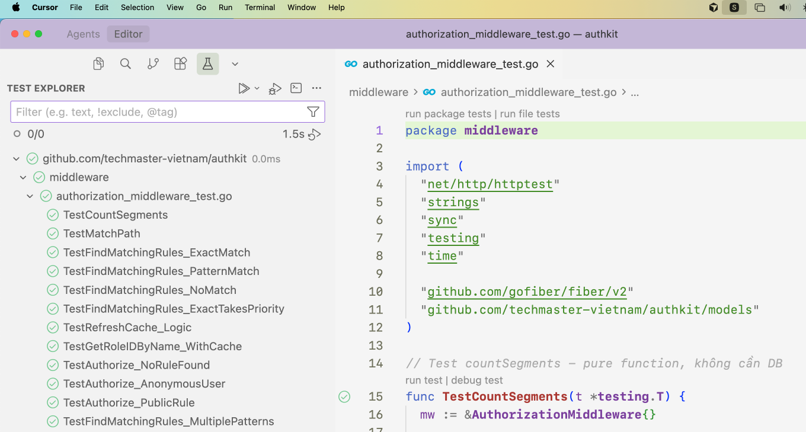

# Unit Tests cho Authorization Middleware

File `authorization_middleware_test.go` chứa các unit tests cho `authorization_middleware.go` **không cần kết nối PostgreSQL**.

## Cách chạy tests

```bash
# Chạy tất cả tests
go test ./middleware -v

# Chạy một test cụ thể
go test ./middleware -v -run TestCountSegments

# Xem coverage
go test ./middleware -cover
```

## Các hàm đã được test

### 1. Pure Functions (không cần DB)

#### `countSegments(path string) int`
- Test đếm số segments trong path
- Test cases: empty path, root path, single/multiple segments, paths với/không có leading slash

#### `matchPath(pattern, path string) bool`
- Test logic matching path patterns với wildcard `*`
- Test cases: exact match, wildcard match, multiple wildcards, no match scenarios

### 2. Cache và Rule Matching

#### `findMatchingRules(method, path string) []models.Rule`
- Test tìm rules matching với method và path
- Test exact matches (O(1) lookup)
- Test pattern matches với wildcard
- Test exact match có priority cao hơn pattern match
- Test multiple patterns cùng segment count
- Test different HTTP methods

#### `refreshCache()` logic
- Test logic build cache structure từ rules
- Test phân loại exact rules vs pattern rules
- Test index rules theo method và segment count

#### `getRoleIDByName(roleName string) (uint, error)`
- Test cache hit (không cần query DB)
- Test role name to ID mapping

### 3. Authorization Logic với Roles

#### `Authorize()` middleware - Basic
- Test PUBLIC rule (cho phép anonymous access)
- Test no rule found (default FORBID)
- Test anonymous user với non-PUBLIC rule (trả về 401)

#### `Authorize()` middleware - Role-based Authorization
- **TestAuthorize_UserWithAllowedRole**: Test user có role được ALLOW truy cập endpoint
  - Admin role được phép
  - Editor role được phép
  - Regular user bị từ chối
  
- **TestAuthorize_UserWithForbiddenRole**: Test user có role bị FORBID
  - Banned user bị từ chối (FORBID có priority cao hơn ALLOW)
  - Admin user được phép (FORBID không áp dụng)
  
- **TestAuthorize_AllowAnyAuthenticatedUser**: Test ALLOW rule với empty roles (any authenticated user)
  
- **TestAuthorize_ForbidEveryone**: Test FORBID rule với empty roles (forbid everyone, kể cả admin)
  
- **TestAuthorize_SuperAdminBypass**: Test super admin bypass tất cả rules
  - Super admin có thể truy cập mọi endpoint
  - Regular user bị từ chối
  
- **TestAuthorize_RoleContextHeader**: Test X-Role-Context header
  - User có multiple roles, chọn role context phù hợp - được phép
  - User chọn role context không phù hợp - bị từ chối
  - User không có role được yêu cầu - bị từ chối
  
- **TestAuthorize_MultipleRulesSameEndpoint**: Test multiple rules cùng endpoint
  - FORBID và ALLOW rules cùng endpoint
  - FORBID có priority cao hơn ALLOW

## Cách test hoạt động

### Không cần Database

Tests sử dụng các kỹ thuật sau để tránh cần database:

1. **Pure Functions**: Test các hàm không có side effects (`countSegments`, `matchPath`)

2. **Mock Cache**: Trực tiếp setup cache structure thay vì gọi repository:
   ```go
   mw.exactRulesMap["GET|/api/users"] = []models.Rule{...}
   ```

3. **Test Logic Riêng**: Test logic của `refreshCache` bằng cách simulate rules data thay vì gọi repository thực sự

4. **Minimal Middleware Setup**: Tạo middleware với empty/nil repositories và chỉ test các phần không cần DB

### Test Coverage

Hiện tại coverage khoảng **28.0%** vì:
- Test các pure functions và logic quan trọng
- Test role-based authorization với các scenarios khác nhau
- Test super admin bypass và X-Role-Context header

## Test Cases mới - Role-based Authorization

Đã thêm các test cases để giả lập user với các role khác nhau:

### Helper Function
- `setupUserContextMiddleware(userID, roleIDs)`: Middleware helper để setup user và roles trong fiber context

### Test Scenarios

1. **User với Allowed Role**: Test user có role được phép truy cập endpoint
2. **User với Forbidden Role**: Test user có role bị cấm (FORBID rule)
3. **Allow Any Authenticated User**: Test rule cho phép bất kỳ authenticated user nào
4. **Forbid Everyone**: Test rule cấm tất cả users (kể cả admin)
5. **Super Admin Bypass**: Test super admin có thể bypass tất cả rules
6. **X-Role-Context Header**: Test user có multiple roles, chọn role context cụ thể
7. **Multiple Rules Same Endpoint**: Test FORBID và ALLOW rules cùng endpoint


## Lưu ý

- Tests hiện tại focus vào **logic correctness** hơn là **status codes chính xác**
- Một số tests kiểm tra error messages thay vì status codes vì fiber có thể trả về 500 nếu không có error handler
- Để test đầy đủ với real HTTP status codes, cần setup fiber app với error handler phù hợp

